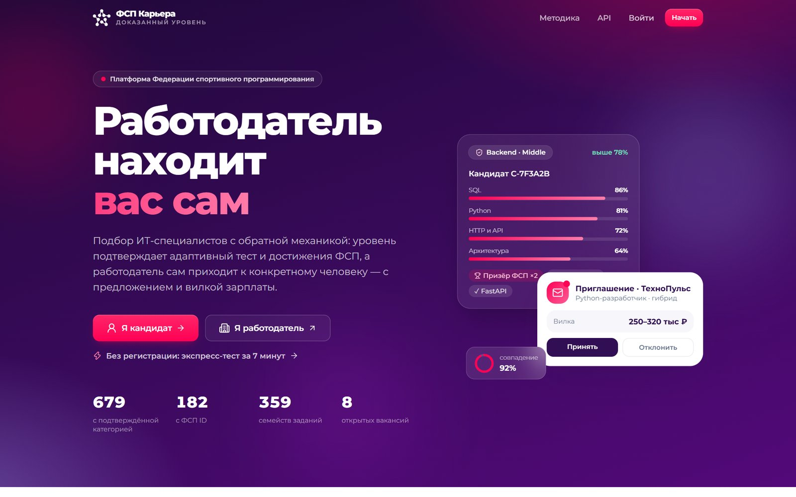
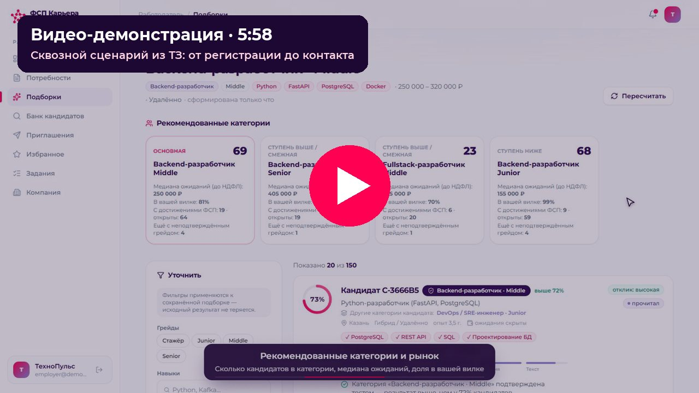
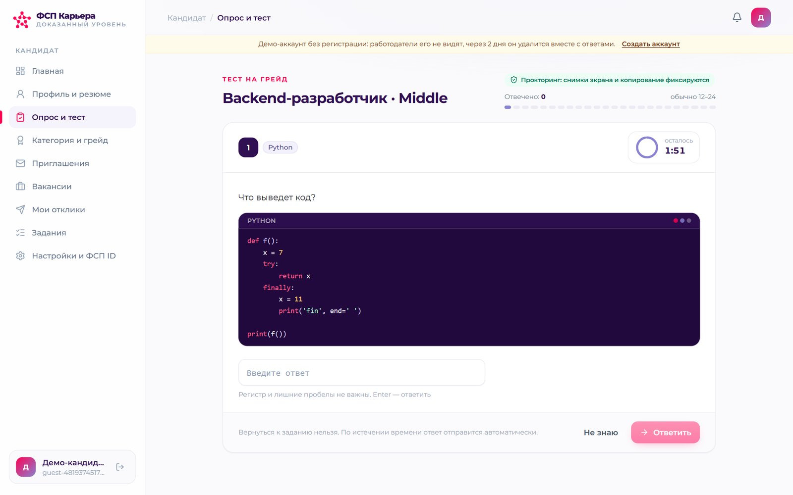
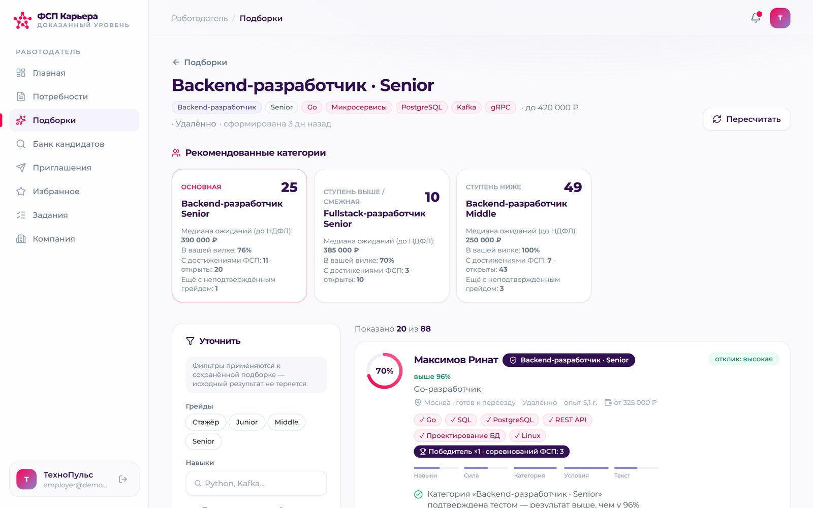
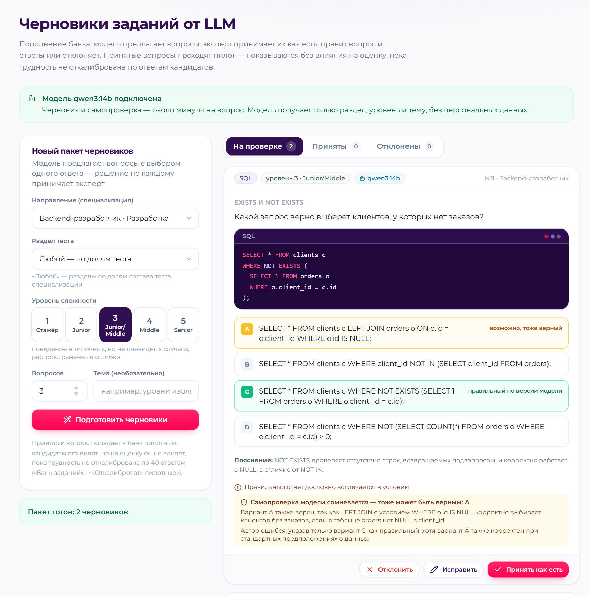
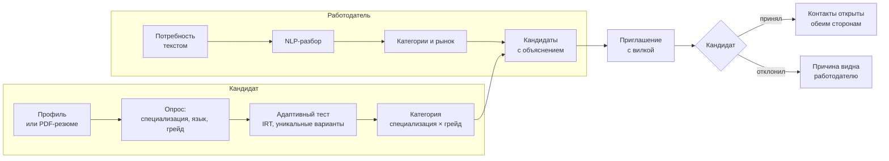
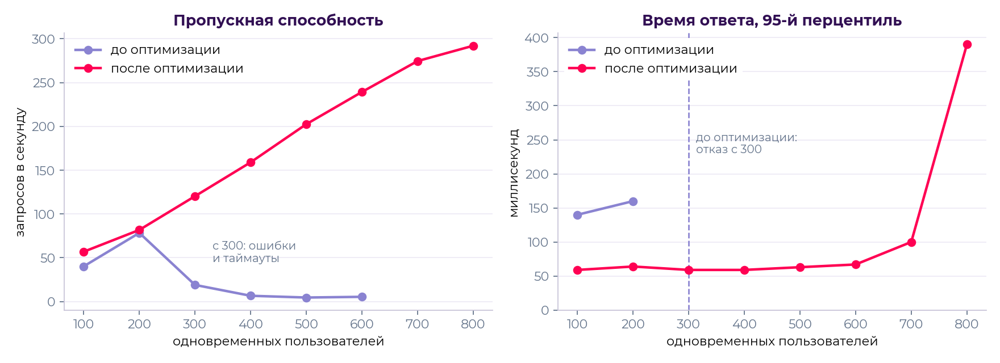

<div align="center">

<picture>
  <source media="(prefers-color-scheme: dark)" srcset="frontend/public/brand/fsp-logo-white.png">
  
</picture>

# ФСП Карьера

**Подбор ИТ-специалистов с обратной механикой.** Уровень кандидата подтверждает адаптивный тест, устойчивый к
утечкам, а работодатель сам находит нужную категорию и приходит к конкретному человеку — с предложением и
обязательной вилкой зарплаты. Контакты открываются только с согласия кандидата.

Специальный трек ФСП · хакатон «Лидеры цифровой трансформации — 2026»


[](https://github.com/andercat2/fsp-career/actions/workflows/ci.yml)


[Видео](https://github.com/andercat2/fsp-career/releases/download/v1.0/fsp-career-demo.mp4) · [Быстрый старт](#быстрый-старт) · [Возможности](#возможности) · [Как это работает](#как-это-работает) ·
[Валидация](#результаты-валидации) · [Документация](docs/fsp-career-documentation.pdf) ·
[Презентация](docs/fsp-career-presentation.pdf) · [Требования ТЗ](REQUIREMENTS.md) · [Команда](#команда)

</div>



## Коротко

- **Категория — по тесту, а не по резюме.** Кандидат проходит опрос и адаптивный тест и получает категорию
  «специализация × грейд». Подборки работодателя строятся из категорий, подтверждённых тестом.
- **Тест, который бесполезно «сливать».** 359 семейств заданий: у каждого кандидата свои данные, код и ответы, общая
  шкала IRT делает результаты сопоставимыми, три детектора и прокторинг ловят списывание.
- **Инициатива у работодателя.** Потребность описывается обычным текстом, NLP находит категории и кандидатов с
  объяснением «почему он здесь», приглашение уходит с вилкой «от–до» — без откликов вслепую.
- **ФСП ID и достижения.** Вход и привязка профиля по OpenID Connect (пути Keycloak), достижения из реестра ФСП
  поднимают кандидата внутри категории; без истории ФСП кандидат участвует на равных.
- **Проверено цифрами.** Собственная процедура валидации на синтетической популяции с известной истиной: грейд по
  тесту завышен у 3% кандидатов против 36% в резюме, точность подборки P@10 — 0,84 против 0,75 у фильтров;
  нагрузочный тест — 800 одновременных пользователей на одной машине без ошибок.

[](https://github.com/andercat2/fsp-career/releases/download/v1.0/fsp-career-demo.mp4)

🎬 **Видео-демонстрация** (5:58): регистрация → опрос и тест → категория → поиск работодателем → приглашение →
контакт, отклик на вакансию, механики тестирования и подбора, проверка подбора на своих данных —
[1080p](https://github.com/andercat2/fsp-career/releases/download/v1.0/fsp-career-demo.mp4) · [720p](https://github.com/andercat2/fsp-career/releases/download/v1.0/fsp-career-demo-720p.mp4) · [релиз со всеми материалами сдачи](https://github.com/andercat2/fsp-career/releases/tag/v1.0).

## Быстрый старт

Нужен Docker Desktop (или Docker Engine с Compose v2) и свободные порты 8080, 8000, 8090, 8025.

```bash
git clone --depth 1 https://github.com/andercat2/fsp-career.git   # только текущая версия, без истории
cd fsp-career
docker compose up --build
```

Первая сборка — 5–8 минут, затем бэкенд создаёт схему БД и наполняет её демо-данными: 700 кандидатов, компании,
вакансии (около 40 секунд). Стенд готов, когда открывается http://localhost:8080.

| Адрес | Что там |
|---|---|
| http://localhost:8080 | приложение |
| http://localhost:8080/docs | Swagger UI — 105 методов API с описаниями и примерами |
| http://localhost:8080/methodology | методика и результаты валидации |
| http://localhost:8080/evaluate | проверка подбора на своём наборе пар «вакансия — кандидат» |
| http://localhost:8025 | Mailpit — письма с кодами подтверждения |
| http://localhost:8090 | ФСП ID (mock): OIDC-провайдер, совместимый по путям с Keycloak, и реестр достижений |

**Без регистрации:** кнопка «Без регистрации» на главной создаёт демо-кандидата в один клик и сразу запускает
экспресс-тест (8 заданий, ≈ 7 минут) или полный.

**Демо-аккаунты** (пароль `demo12345`, на странице входа выбираются одним кликом):

| E-mail | Роль | Что посмотреть |
|---|---|---|
| `employer@demo.ru` | работодатель «ТехноПульс» | подборки с объяснениями, банк кандидатов, приглашения, задачи с кодом и антиплагиат |
| `candidate@demo.ru` | кандидат: Backend · Middle и DevOps · Junior | категории, приглашения с вилкой, достижения ФСП, отклики, задача с кодом |
| `newbie@demo.ru` | новый кандидат | сквозной путь: опрос → адаптивный тест → категория |
| `admin@demo.ru` | администратор | банк заданий, черновики от LLM, журнал честности тестов |

ФСП ID (mock): `alice` (призёр, три достижения) и `gleb` (без истории), пароль `fsp12345`.

## Возможности

### Кандидату

- Профиль вручную или из PDF-резюме с автораспознаванием — включая двухколоночный экспорт hh.ru: ФИО, контакты,
  стек, должности с датами, стаж, образование, языки, роли и софт-скиллы. Стандартизированный PDF-профиль.
- До трёх резюме под разные специализации — у каждого свой опрос, тест и категория.
- Адаптивный тест на 12–24 задания под прокторингом: время на задание зависит от формата и трудности, снимок экрана
  или копирование — предупреждение, повтор — досрочное завершение с пониженной оценкой.
- Экспресс-тест на 8 заданий — пробная оценка с вероятностями грейдов, без влияния на категорию.
- Честные правила: грейд не понижается принудительно, не прошли — грейд ниже по тому же тесту или тест уровнем ниже
  сразу; смена грейда — не чаще раза в месяц. Неподтверждённый грейд виден работодателям со статусом, а не скрыт.
- Приглашения с вилкой, компанией и способом связи до начала общения: принять, отклонить с причиной, пожаловаться.
- Вакансии и отклики, регулярные задания, задачи с кодом в редакторе с запуском на тестах.
- Приватность и согласия по 152-ФЗ, выгрузка и удаление данных, привязка ФСП ID.



### Работодателю

- Потребность — обычным текстом: NLP определяет специализацию, грейды, обязательные и желательные навыки, вилку,
  формат и город.
- Подборка: рекомендованные категории с аналитикой рынка (медиана ожиданий, доля в вашей вилке, сколько с
  достижениями ФСП) и ранжированные кандидаты с причинами «за» и «против». Фильтры — поверх сохранённой подборки.
- Банк кандидатов с фильтрами, избранное, приглашение по конкретному резюме с обязательной вилкой и оценкой
  вероятности отклика; статусы приглашений и откликов.
- Задачи с кодом: функция, открытые и скрытые тесты, эталон; решения проверяются в песочнице без сети, антиплагиат
  по структуре кода, сигналы редактора (вставки из буфера, уходы со вкладки).



### Администратору

- Банк заданий: экспозиция, дрейф решаемости (утёкшее задание само выводится из ротации), калибровка пилотных заданий.
- **Черновики заданий от LLM:** выбор направления, раздела, уровня и числа вопросов → модель пишет черновики и сама
  их перепроверяет → эксперт принимает как есть, исправляет вопрос и ответы или отклоняет. Принятый вопрос входит в
  банк пилотным и не влияет на оценки, пока трудность не откалибрована по ответам кандидатов.
- Журнал честности тестов: нарушения прокторинга и сессии, помеченные детекторами.



## Как это работает



**Тестирование.** Единица банка — семейство заданий: шаблон с фиксированной темой, уровнем и параметрами IRT. При
каждом показе генератор строит свой вариант — данные, массивы, SQL-таблицы, код на языке кандидата — и сам вычисляет
верный ответ. Уровень оценивается по модели IRT 3PL методом EAP на общей шкале, поэтому кандидаты с разными
заданиями сопоставимы. Адаптивный алгоритм выбирает задания по информации Фишера с балансом разделов и контролем
экспозиции. Ответ, списанный из «слитой базы», к своему варианту не подходит — и выдаёт списывание.

**Подбор.** Оценка кандидата складывается из пяти объяснимых компонент:
`(0,30·навыки + 0,25·сила профиля + 0,20·категория + 0,15·условия + 0,10·текст) · доступность`. Навыки получают
статус по свидетельствам теста: «подтверждён», «заявлен», «не подтвердился».

**Пополнение банка.** Разработчик добавляет статичный вопрос одной строкой или параметрическое задание функцией с
генератором (руководство — раздел 12 документации). Администратор пополняет банк черновиками от LLM с проверкой
экспертом; LLM участвует только здесь — в тестировании кандидатов и подборе её нет.

## Результаты валидации

Эталонной разметки на хакатоне нет, поэтому качество проверено на синтетической популяции с известной истиной
(35% кандидатов завышают резюме). Отчёт — [`SUMMARY.md`](backend/validation/reports/SUMMARY.md), воспроизведение —
`python -m validation.run_all` (≈ 5 минут).

| Метрика | Результат |
|---|---|
| Грейд по тесту совпал с истинным / ±1 ступень | 64% / 95% (самооценка в резюме — 57%) |
| Завышение грейда | 3,1% (в резюме — 36%) |
| Повторный тест: взвешенная κ / r(θ̂₁, θ̂₂) | 0,80 / 0,82 |
| Атака «слитой базой» (K = 25): незамеченное завышение | 13,0% — на уровне честного прохождения 12,1% (фиксированный тест — 96,8%) |
| Подбор: P@10 / nDCG@10 / MRR | 0,84 / 0,82 / 0,96 (фильтры по резюме — 0,75 / 0,80 / 0,90; поиск по ключевым словам — 0,27) |
| «Завысившие себя» кандидаты в топ-10 | 2,8% (фильтры по резюме — 20,7%) |
| NLP: специализация вакансии / навыки F1 | 100% / 0,96 |
| Резюме из PDF (80 шт., экспорт hh.ru и свободные): навыки F1 | 0,96 |
| Антиплагиат кода: замаскированные копии / ложные срабатывания | найдено 6 из 6 / 0 из 19 |
| Экспресс-тест (8 заданий, ≈ 7 мин) против полного: r(θ̂, θ) / грейд ±1 | 0,85 / 98,8% (полный — 0,92 / 99,7%) |
| Нагрузка (Locust, одна машина): 300 пользователей всех ролей | 110,1 запр/с без ошибок, p95 50 мс (до оптимизации — 18,3% ошибок) |
| Ступенчатая нагрузка: без ошибок, p95 ≤ 1 с | 800 одновременных пользователей (до оптимизации — 200) |

**Проверьте подбор на своих данных:** страница `/evaluate` принимает набор пар «вакансия — кандидат» с разметкой
(JSON или CSV), строит выдачу тем же ранжированием и считает P@10, nDCG@10 и MRR рядом с поиском по ключевым словам.
На встроенном примере из валидации P@10 — 0,70 против 0,38 у поиска по ключевым словам.

### Нагрузочное тестирование

Сценарии на Locust (`loadtest/`): посетители, кандидаты в кабинете и на тесте, работодатели. Тест нашёл
взаимоблокировку пула потоков FastAPI и пула соединений с БД (при всплеске сервер зависал до таймаута), несколько
тяжёлых запросов и рост памяти под нагрузкой; после исправлений стенд на одной машине держит 800 одновременных
пользователей без ошибок, p95 на верхней ступени — 390 мс. Подробности — раздел 3.5 документации и
[`loadtest/results/SUMMARY.md`](loadtest/results/SUMMARY.md).



## Архитектура


Модульный монолит на FastAPI: `api` (роутеры, валидация, права) → `services` (бизнес-логика без HTTP) → `models`
(SQLAlchemy). Ядро тестирования (`irt.py`, `cat.py`, банк заданий) не зависит от БД и используется в валидации.
Бэкенд не хранит состояние между запросами и масштабируется репликами; код кандидатов исполняется в отдельном
контейнере песочницы без сети.

```
backend/          FastAPI: api/, services/ (testing, matching, nlp, fsp, pdf, sandbox), models/, seed/, validation/, tests/
frontend/         React 18 + TypeScript + Vite + Tailwind + framer-motion
fsp-mock/         OIDC-провайдер «ФСП ID» (пути как в Keycloak) и реестр достижений
sandbox/          контейнер песочницы: исполнение кода кандидатов на Unix-сокете
docs/             документация (PDF, DOCX, Markdown), презентация (PPTX, PDF), иллюстрации, таблица API
REQUIREMENTS.md   требования ТЗ и где они выполнены
```

## Документы

| Документ | Формат |
|---|---|
| Сопроводительная документация: механики, архитектура, валидация, API, безопасность, расширение банка | [PDF](docs/fsp-career-documentation.pdf) · [DOCX](docs/fsp-career-documentation.docx) · [Markdown](docs/documentation.md) |
| Презентация | [PDF](docs/fsp-career-presentation.pdf) · [PPTX](docs/fsp-career-presentation.pptx) |
| Требования ТЗ и как они выполнены | [REQUIREMENTS.md](REQUIREMENTS.md) |
| Перечень эндпоинтов API | [api_endpoints.md](docs/api_endpoints.md) · Swagger на стенде: `/docs` |
| Результаты валидации | [SUMMARY.md](backend/validation/reports/SUMMARY.md) · страница `/methodology` |

### Публичный стенд на сервере

На виртуальном сервере (Ubuntu, 2 vCPU, 4 ГБ RAM, открыты 80 и 443) — одна команда; HTTPS через Caddy, адрес
`https://<IP>.sslip.io` без своего домена (подробности — раздел 11.5 документации):

```bash
curl -fsSL https://raw.githubusercontent.com/andercat2/fsp-career/main/deploy/deploy.sh | bash
```

## Разработка

```bash
# бэкенд (SQLite в backend/data, демо-данные создаются при первом старте)
python -m venv .venv && .venv/Scripts/activate          # Linux/macOS: source .venv/bin/activate
pip install -r backend/requirements.txt
cd backend && uvicorn app.main:app --port 8000

# mock ФСП ID и реестра — в отдельном терминале
pip install -r fsp-mock/requirements.txt && cd fsp-mock && uvicorn app.main:app --port 8090

# фронтенд — в отдельном терминале, http://localhost:5173 (запросы /api проксируются на :8000)
cd frontend && npm ci && npm run dev

# тесты и валидация
cd backend && python -m pytest -q && python -m validation.run_all
```

Черновики заданий от LLM работают с любым OpenAI-совместимым API: по умолчанию стенд обращается к Ollama на хосте
(`ollama pull qwen3:14b`), без неё включается демо-режим с заранее сгенерированными черновиками. Настройки —
`LLM_BASE_URL`, `LLM_MODEL`, `LLM_API_KEY` в `.env` (пример — [`.env.example`](.env.example)).

## Технологии

| Слой | Технологии |
|---|---|
| Бэкенд | Python 3.11, FastAPI, SQLAlchemy 2, Pydantic 2, PostgreSQL 16 (SQLite локально) |
| ML и NLP | собственная реализация IRT 3PL + EAP на NumPy, scikit-learn (TF-IDF, логистическая регрессия), Natasha, pdfminer.six |
| LLM (только черновики заданий) | Qwen3-14B через Ollama или любой OpenAI-совместимый API |
| Фронтенд | React 18, TypeScript, Vite, Tailwind CSS, TanStack Query, framer-motion, Recharts |
| Инфраструктура | Docker Compose, nginx, песочница без сети (Python, Node.js), Mailpit |

Все компоненты — открытое ПО под разрешительными лицензиями; точные версии — в `backend/requirements.txt` и
`frontend/package-lock.json`.

## Безопасность и 152-ФЗ

- Согласие на обработку ПДн при регистрации и отдельное — на публикацию профиля; журнал согласий; выгрузка и удаление данных.
- Контакты скрыты до принятия приглашения или собственного отклика кандидата; доступ к ним журналируется.
- Argon2id для паролей, коды подтверждения как HMAC, JWT с ограниченным сроком, ограничение частоты попыток, права
  по ролям на каждом эндпоинте.
- Код кандидатов исполняется в контейнере без сети; LLM не получает персональных данных.

## Команда

**«Рекрут 2»** — РТУ МИРЭА (программная инженерия, системы поддержки принятия решений), оба работаем в «Газпром
автоматизации».

| Участник | Роль | Telegram |
|---|---|---|
| **Мурехин Ярослав Андреевич** | капитан, ML/AI-инженер, backend | [@Y_murik](https://t.me/Y_murik) |
| **Воронин Артём Тимофеевич** | frontend, backend | [@hl0pch1k](https://t.me/hl0pch1k) |

## Лицензия

[MIT](LICENSE)
