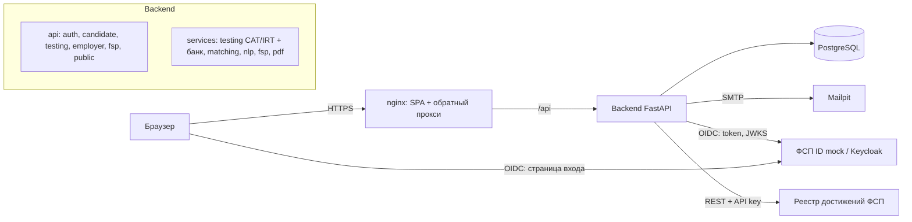

# ФСП Карьера

Платформа подбора ИТ-специалистов **с обратной механикой**: кандидаты распределяются по категориям
(специализация × грейд) по результатам адаптивного тестирования и подтверждённых достижений Федерации спортивного
программирования, а работодатель сам находит нужную категорию и выходит на конкретного человека — с предложением и
обязательной вилкой зарплаты. Контакты кандидата раскрываются только после его согласия.

Решение для специального трека ФСП хакатона «Лидеры цифровой трансформации — 2026».

| | |
|---|---|
| Приложение | http://localhost:8080 |
| API (Swagger / OpenAPI) | http://localhost:8080/docs · http://localhost:8080/openapi.json |
| Почта (Mailpit) | http://localhost:8025 |
| ФСП ID (mock, OIDC как в Keycloak) | http://localhost:8090 |
| Методика и результаты валидации | http://localhost:8080/methodology |

---

## Быстрый старт (Docker)

Нужен Docker Desktop (или Docker Engine + Compose v2). Свободные порты: 8080, 8000, 8090, 8025.

```bash
docker compose up --build
```

Первый старт: сборка образов ~5–8 минут, затем бэкенд создаёт схему БД и наполняет демо-данными (~10 секунд).
Стенд готов, когда http://localhost:8080 открывает главную страницу. Остановка — `docker compose down`
(данные сохраняются в томе `pgdata`; полный сброс — `docker compose down -v`).

Суммарный лимит памяти контейнеров ≈ 2 ГБ (PostgreSQL 512 МБ, бэкенд 1 ГБ, остальные — по 128–192 МБ).

### Демо-аккаунты

Пароль у всех — `demo12345`. На странице входа их можно выбрать одним кликом.

| E-mail | Роль | Что показать |
|---|---|---|
| `employer@demo.ru` | Работодатель «ТехноПульс» | потребности, подборка с объяснениями, приглашения, задания, тест по вакансии |
| `candidate@demo.ru` | Кандидат с категорией Backend · Middle | приглашения с вилкой, ФСП-достижения, отклики, задания |
| `newbie@demo.ru` | Новый кандидат | сквозной сценарий: опрос → адаптивный тест → категория |
| `admin@demo.ru` | Администратор | статистика банка заданий, экспозиция, дрейф, калибровка |

Учётные записи ФСП ID (mock) для привязки и входа: `alice` (призёр, 3 достижения) и `gleb` (нет истории) —
пароль `fsp12345`. Также можно войти любым участником реестра по его ФСП ID.

### Сценарий демонстрации (≈ 7 минут)

1. **Регистрация соискателя** — `/register`: e-mail, пароль, согласие 152-ФЗ → код подтверждения (в демо-режиме
   показывается на экране и приходит в Mailpit). Или войдите как `newbie@demo.ru`.
2. **Профиль** — загрузите PDF-резюме: ФИО, контакты, стек, стаж, роли распознаются автоматически.
3. **Опрос и тест** — специализация, язык, опыт, предполагаемый грейд → адаптивный тест (12–24 задания, у каждого
   кандидата уникальные варианты, таймер). Результат: решение по грейду, процентиль, профиль по доменам.
4. **ФСП ID** — «Настройки» → «Привязать ФСП ID» → вход `alice / fsp12345` → достижения подтянулись из реестра.
5. **Работодатель** (`employer@demo.ru`) → «Подборки» → опишите потребность текстом (есть готовые примеры)
   → рекомендованные категории с медианой ожиданий и долей «в вашей вилке» → ранжированные кандидаты
   с объяснением «почему в подборке» → фильтры поверх сохранённой подборки.
6. **Выход на контакт** — «Пригласить»: вилка обязательна, видна оценка вероятности отклика → кандидат видит
   предложение с условиями → принимает → контакты открываются обеим сторонам (или отклоняет с причиной).
7. **Классический отклик** — кандидат: «Вакансии» → отклик; работодатель видит отклики с оценкой совпадения.
8. **Тест по вакансии** — работодатель: потребность → вкладка «Тест по вакансии»: блюпринт, примеры заданий и три
   варианта одного семейства для разных кандидатов.
9. **Методика** — `/methodology`: результаты валидации тестирования, устойчивости к утечкам и подбора.

---

## Что внутри

### Ключевые механики

**Тестирование, устойчивое к распространению заданий**
- Банк из **359 семейств заданий** по 27 доменам (125 параметрических). Семейство — шаблон с откалиброванной
  трудностью; для каждого кандидата генерируется свой вариант: свои данные, массивы, таблицы (SQL-запросы реально
  выполняются в SQLite), код на основном языке кандидата (Python / JavaScript / Java / Go). Ответ вычисляется.
- **Адаптивный тест (CAT) на модели IRT 3PL**: выбор задания по максимуму информации Фишера с балансировкой
  доменов по блюпринту специализации и контролем экспозиции; оценка уровня θ — EAP с общим prior, поэтому
  результаты кандидатов с разными наборами заданий сопоставимы.
- Решение по грейду: подтверждён, если P(θ ≥ нижней границы грейда) ≥ 0.6; «уверенно» — если с вероятностью
  ≥ 0.8 выше верхней границы (сразу доступен тест уровнем выше). Не подтвердил — сразу доступен тест уровнем ниже;
  грейд не понижается принудительно; смена грейда — не чаще раза в 90 дней, повтор уровня — через 30 дней.
- **Три детектора нечестности**: ответ «чужого варианта» (списанный ответ не подходит к своему варианту),
  дрейф решаемости задания относительно модели (утечка статичных заданий → автоматический вывод из ротации),
  person-fit lz и слишком быстрые верные ответы на трудные задания.
- Пилотные задания (в том числе черновики, сгенерированные LLM) встраиваются без влияния на оценку и
  калибруются онлайн по реальным ответам — так генеративные задания получают сопоставимую трудность.

**Подбор с обратной механикой**
- Потребность работодателя (текст вакансии) разбирается NLP: специализация (TF-IDF + логистическая регрессия
  в гибриде с правилами по онтологии из 120+ навыков), грейды, обязательные и желательные навыки, вилка, формат, город.
- Пул кандидатов — только из **категорий, присвоенных тестом**; рекомендуются основная категория, соседние грейды
  и смежные специализации — с аналитикой рынка (медиана ожиданий, доля в вилке, число с достижениями ФСП).
- Ранжирование: `(0.30·навыки + 0.25·сила профиля + 0.20·категория + 0.15·условия + 0.10·текст) · доступность`,
  где сила профиля = 0.6·тест + 0.25·ФСП + 0.15·регулярные задания. Навыки оцениваются по свидетельствам теста
  на уровне требований вакансии. Каждая карточка объясняет, почему кандидат в подборке.
- Приглашение: вилка «от–до» обязательна, привязка к вакансии необязательна, оценка вероятности отклика,
  статусы «отправлено → просмотрено → принято / отклонено (с причиной) / истекло / отозвано».

**Интеграция с ФСП**
- Привязка и вход через **ФСП ID** по OpenID Connect (authorization code + PKCE, проверка id_token по JWKS).
  Пути эндпоинтов совпадают с Keycloak (`/realms/<realm>/protocol/openid-connect/...`) — для подключения к реальному
  ФСП ID достаточно сменить `FSP_PUBLIC_ISSUER` и учётные данные клиента.
- Реестр достижений: соревнования, уровень, дисциплина, место, команда, разряд, рейтинг. Кандидат без истории ФСП
  участвует в подборе наравне — достижения дают только бонус к силе профиля.

### Результаты валидации

Эталонной разметки нет, поэтому построена собственная процедура на синтетической популяции с известной «истиной»
(35% кандидатов завышают резюме). Полный отчёт — [`backend/validation/reports/SUMMARY.md`](backend/validation/reports/SUMMARY.md),
воспроизведение — `python -m validation.run_all` (≈2 минуты).

| Метрика | Значение |
|---|---|
| Грейд по тесту совпал с истинным / ±1 ступень | 68% / 96% (самооценка в резюме — 57%) |
| Завышение грейда | 2.4% (в резюме — 36%) |
| Повторный тест: взвешенная κ / r(θ̂₁, θ̂₂) | 0.80 / 0.82 |
| Медиана дискриминативности D / доля заданий с D ≥ 0.3 | 0.43 / 82% |
| Атака «слитой базой» (K = 25): незамеченное завышение | 11.7% (фиксированный тест — 96.5%) |
| Подбор: P@10 / nDCG@10 / MRR | 0.80 / 0.82 / 0.98 (фильтры по резюме — 0.74 / 0.80 / 0.92; поиск по ключевым словам — 0.27) |
| «Завысившие себя» кандидаты в топ-10 | 4.0% (фильтры по резюме — 17.7%) |
| NLP: специализация вакансии / навыки F1 | 100% / 0.96 (28 размеченных текстов) |
| NLP: резюме из PDF — ФИО / контакты / стаж ±0.5 г. | 95% / 100% / 98% |

### Архитектура



Модульный монолит с явным разделением слоёв: `api` (роутеры, валидация, права) → `services` (бизнес-логика без
HTTP) → `models` (SQLAlchemy). Ядро тестирования (`services/testing/cat.py`, `irt.py`) не зависит от БД и
переиспользуется в симуляциях валидации. Бэкенд stateless — масштабируется репликами.

---

## Локальный запуск без Docker

Требования: Python 3.11, Node.js 20+.

```bash
# 1. Бэкенд (по умолчанию SQLite в backend/data, демо-данные создаются при первом старте)
python -m venv .venv
.venv/Scripts/activate            # Linux/macOS: source .venv/bin/activate
pip install -r backend/requirements.txt
cd backend && uvicorn app.main:app --port 8000

# 2. Mock ФСП ID и реестра (в отдельном терминале)
pip install -r fsp-mock/requirements.txt
cd fsp-mock && uvicorn app.main:app --port 8090

# 3. Фронтенд (в отдельном терминале) — http://localhost:5173, запросы /api проксируются на :8000
cd frontend && npm ci && npm run dev
```

Тесты и валидация:

```bash
cd backend
python -m pytest -q                 # 491 тест: банк заданий, сквозной сценарий, правила видимости, PDF, NLP
python -m validation.run_all        # полный прогон валидации → validation/reports/*.json, SUMMARY.md
```

## Структура репозитория

```
backend/
  app/
    api/            роутеры REST API (OpenAPI генерируется автоматически)
    core/           конфигурация, БД, безопасность (Argon2id, JWT), почта
    models/         модели SQLAlchemy
    schemas/        схемы запросов/ответов Pydantic
    services/
      testing/      IRT, адаптивный тест, банк заданий (bank/), детекторы, превью теста по вакансии
      matching/     сила профиля, категории, ранжирование, объяснения
      nlp/          разбор вакансий и резюме
      fsp/          OIDC-клиент ФСП ID, реестр, скоринг достижений
      pdf/          стандартизированный PDF-профиль
    seed/           демо-данные и синтетическая популяция
  validation/       процедура валидации и отчёты
  tests/            pytest
fsp-mock/           OIDC-провайдер «ФСП ID» (совместим по путям с Keycloak) + реестр достижений
frontend/           React + TypeScript + Vite + Tailwind + framer-motion
docs/               сопроводительная документация
docker-compose.yml
```

## Технологии

| Компонент | Технологии (лицензии) |
|---|---|
| Backend | Python 3.11, FastAPI 0.142, Starlette, Uvicorn, Pydantic 2, SQLAlchemy 2.1 (MIT), psycopg 3 (LGPL) |
| Хранилище | PostgreSQL 16 (PostgreSQL License); SQLite для локального запуска |
| ML / NLP | NumPy, SciPy, scikit-learn (BSD), Natasha / Slovnet (MIT), pdfminer.six (MIT) |
| Безопасность | argon2-cffi (MIT), PyJWT + cryptography (MIT / Apache-2.0) |
| Документы | ReportLab (BSD), шрифт Montserrat (OFL) |
| Frontend | React 18, React Router 6, TanStack Query 5, Tailwind CSS 3, framer-motion 11, Recharts 2, lucide-react (MIT) |
| Инфраструктура | Docker, nginx (BSD-2), Mailpit (MIT) |

Точные версии — `backend/requirements.txt`, `frontend/package-lock.json`, `fsp-mock/requirements.txt`.

## Безопасность и 152-ФЗ

- Согласие на обработку ПДн — обязательно при регистрации; согласие на публикацию профиля — отдельно; журнал
  согласий с датой и устройством; отзыв согласия скрывает профиль. Выгрузка всех своих данных и удаление аккаунта.
- Контакты кандидата скрыты до принятия приглашения или собственного отклика; доступ к контактам журналируется.
  По умолчанию работодатель видит анонимный код вместо имени (снижает предвзятость).
- Пароли — Argon2id; коды подтверждения хранятся как HMAC; JWT с ограниченным сроком; ограничение частоты попыток
  входа; разграничение прав по ролям на каждом эндпоинте; кандидат видит только свои приглашения и отклики.
- Защита от недобросовестных работодателей: суточный лимит приглашений, индекс доверия компании (домен e-mail ↔ сайт,
  жалобы кандидатов), жалоба на приглашение, кандидат может скрыть предложения ниже своих ожиданий.

## Лицензия

MIT — см. [LICENSE](LICENSE).
