# ФСП Карьера — сопроводительная документация

Платформа подбора ИТ-специалистов с обратной механикой. Специальный трек ФСП, хакатон «Лидеры цифровой трансформации — 2026». Версия 1.3, 7 октября 2026 г.

<!-- toc -->

# 1. Обзор решения

## 1.1. Задача и подход

Универсальные площадки сводят подбор к совпадению ключевых слов в самоописании: работодатель вручную разбирает сотни откликов, кандидат откликается вслепую. «ФСП Карьера» меняет направление инициативы. Кандидат один раз проходит обязательный путь — опрос по специализации, выбор предполагаемого грейда и адаптивный тест — и получает **категорию** (специализация × грейд), подтверждённую тестом. Работодатель описывает потребность обычным текстом, система показывает подходящие категории с аналитикой рынка и ранжированных кандидатов с объяснением, а работодатель сам выходит на конкретного человека с предложением и **обязательной вилкой зарплаты**. Контакты кандидата раскрываются только после его согласия.

Семь решений, на которых держится продукт:

- **Категория — по тесту, а не по резюме.** Выдача формируется из категорий, присвоенных тестированием; самоописание влияет лишь на объяснения и текстовую близость. Если тест не подтвердил заявленный грейд, кандидат не исчезает: работодатель видит его со статусом «не подтверждён» и ниже подтверждённых.
- **Тест, устойчивый к утечкам.** Банк из 359 семейств заданий: у каждого кандидата свои варианты (данные, код на его языке, верный ответ вычисляется), адаптивный подбор заданий по модели IRT, контроль экспозиции, три детектора нечестного прохождения и прокторинг в браузере (снимок экрана: первый раз — предупреждение, второй — досрочное завершение с пониженной оценкой). Сложность вариантов одного семейства одинакова по построению, поэтому оценки разных кандидатов сопоставимы; время на ответ зависит от формата и трудности задания.
- **Несколько специализаций — несколько категорий.** Кандидат ведёт до трёх резюме под разные специализации; у каждого свой опрос, свой тест и своя категория. Работодатель находит кандидата в каждой подтверждённой категории и приглашает по конкретному резюме.
- **Объяснимое ранжирование.** Итоговая оценка складывается из пяти понятных компонент; каждая карточка кандидата содержит причины «за» и «против».
- **Прозрачный выход на контакт.** Приглашение содержит описание, вилку «от–до», компанию и способ связи; кандидат видит условия до общения, принимает или отклоняет с причиной.
- **ФСП ID и достижения.** Привязка профиля через OpenID Connect с путями Keycloak; достижения из реестра — результативность и число соревнований, все дисциплины равнозначны — поднимают кандидата внутри категории, но не меняют грейд; отсутствие истории ФСП не штрафует кандидата.
- **Задачи с кодом в песочнице.** Работодатель задаёт функцию, открытые и скрытые тесты и эталон; решение кандидата исполняется в контейнере без сети и проверяется автоматически, а антиплагиат по структуре кода и сигналы редактора (вставки из буфера, уходы со вкладки) защищают от списывания и подсказок LLM.

## 1.2. Роли и сквозной сценарий

| Роль | Основные возможности |
|---|---|
| Кандидат | регистрация по e-mail с кодом; профиль вручную или из PDF-резюме с автораспознаванием (включая двухколоночный экспорт hh.ru); стандартизированный PDF-профиль; до трёх резюме под разные специализации; опрос и адаптивный тест по каждому резюме; категории, грейды, история; приглашения с вилкой (принять, отклонить, пожаловаться); вакансии и отклики выбранным резюме; регулярные задания работодателей, в том числе задачи с кодом — редактор в браузере и запуск на тестах в песочнице; приватность, согласия 152-ФЗ, привязка ФСП ID |
| Работодатель | профиль компании; потребности и вакансии (NLP-разбор текста); подборки: рекомендованные категории, рынок, ранжирование с объяснением, фильтры поверх сохранённого результата; поиск по банку кандидатов; переключение между резюме кандидата; избранное; приглашения по конкретному резюме и их статусы; отклики на вакансии; регулярные задания и проверка решений, задачи с кодом: открытые и скрытые тесты, эталон, автопроверка в песочнице, антиплагиат; отметка о честности теста в карточке кандидата; тест по вакансии (как формируются задания) |
| Администратор | статистика банка заданий: экспозиция, дрейф решаемости, статус семейств; калибровка пилотных заданий; журнал честности тестов: нарушения прокторинга, помеченные детекторами сессии |
| Система (фоновые правила) | предложение регулярных заданий раз в 7 дней; истечение приглашений через 14 дней; вывод «утёкших» заданий из ротации; уведомления в приложении и по e-mail |

Сквозной сценарий демонстрации:

1. Кандидат регистрируется по e-mail, подтверждает адрес кодом и даёт согласие на обработку персональных данных.
2. Заполняет профиль или загружает PDF-резюме — ФИО, контакты и GitHub, желаемая должность и зарплата, формат работы, места работы с датами, стаж, образование, языки, стек, роли и софт-скиллы распознаются автоматически.
3. Проходит опрос (специализация, основной язык, опыт, предполагаемый грейд) и адаптивный тест на выбранный грейд под прокторингом.
4. Получает категорию, например «Backend-разработчик · Middle», профиль по доменам и процентиль; при желании привязывает ФСП ID и добавляет резюме под вторую специализацию (например, DevOps) — со своим тестом и своей категорией.
5. Работодатель описывает потребность текстом; система разбирает её, рекомендует категории и показывает ранжированных кандидатов с объяснениями.
6. Работодатель уточняет подборку фильтрами (исходный результат сохраняется) и отправляет приглашение с вилкой и способом связи.
7. Кандидат видит предложение с условиями и принимает его — контакты открываются обеим сторонам; или отклоняет с причиной.
8. Параллельно доступен классический сценарий: кандидат откликается на опубликованную вакансию, работодатель видит отклик с оценкой совпадения.
9. Работодатель предлагает задачу с кодом; кандидат решает её в редакторе, запускает на примерах и отправляет — решение проверяется тестами в песочнице, работодатель видит результат, сходство с другими решениями и сигналы редактора.

## 1.3. Соответствие требованиям ТЗ

| Требование ТЗ | Как реализовано | Где посмотреть |
|---|---|---|
| Категоризация по обязательному пути: опрос, выбор грейда, тест | Опрос (ИТ-направление и специализация — так постановщики уточнили «отрасль») → выбор уровня с подсказкой по резюме → адаптивный тест; категория = специализация × грейд по результату теста | Кабинет кандидата → «Категория и грейд»; раздел 4 |
| Тестирование, устойчивое к распространению заданий, с сопоставимой сложностью | Параметрические семейства заданий, уникальные варианты, IRT-шкала, контроль экспозиции, детекторы утечки, прокторинг (снимки экрана, печать, копирование) | Разделы 4.2–4.8; страница «Методика» |
| Грейд не понижается принудительно; тест ниже/выше; ограничение частоты | Не подтвердил — грейд ниже по тому же тесту или тест уровнем ниже без ожидания; подтвердил уверенно — тест уровнем выше без ожидания, когда кандидат подтвердит готовность; смена грейда и повтор уровня — не чаще раза в месяц | Раздел 4.5 |
| Регулярные короткие задания от работодателей | Раз в 7 дней кандидату предлагается задание его категории; задачи с кодом система проверяет тестами работодателя в песочнице, открытые ответы оценивает работодатель; оценка влияет на силу профиля | Кабинеты → «Задания»; разделы 5.8, 5.9 |
| Выход на контакт по инициативе работодателя | Подборка → приглашение с вилкой, описанием, способом связи, без обязательной привязки к вакансии; статусы | Раздел 2.3; кабинет работодателя → «Приглашения» |
| Связь профиля с ФСП ID; совместимость с Keycloak | OpenID Connect (authorization code + PKCE), пути `/realms/<realm>/protocol/openid-connect/*`, реестр достижений | Раздел 7 |
| Корректная обработка отсутствия истории ФСП | Сигнал ФСП = 0 без штрафа, явная пометка в объяснении, равный доступ к подбору | Разделы 5.5, 7.4 |
| Неподтверждённый грейд — показывать со статусом и опускать в выдаче, не скрывать (рекомендация постановщиков) | Статус «не подтверждён»: кандидат в подборках и банке ниже подтверждённых, ранжируется по измеренной тестом θ без совпадения грейда; можно отключить в настройках приватности; на валидации показ повышает точность выдачи | Разделы 5.1, 6.4 |
| Достижения ФСП — в ранжировании внутри категории, не в грейде (разъяснение постановщиков) | Учитываются результативность и число соревнований; участия без результата — с потолком; дисциплины и уровни соревнований равнозначны | Раздел 5.5 |
| Профиль: форма или PDF с автораспознаванием (ФИО, контакты, стек, грейд, роли, стаж, софт-скиллы); PDF-профиль | Разбор вёрстки PDF по координатам строк (pdfminer.six) — в том числе двухколоночного экспорта hh.ru, — секции свободных резюме, Natasha (NER), онтология из 105 навыков; генерация PDF (ReportLab) | Кабинет кандидата → «Профиль и резюме»; раздел 5.10 |
| Категория и грейд: текущий статус, история опроса и теста | Статус по каждому резюме (специализации): категория, θ, процентиль, ограничения частоты; история тестов с отметками о нарушениях, смен грейда и опросов | Кабинет кандидата → «Категория и грейд»; раздел 5.1 |
| Настройки: приватность, согласия, ФСП ID | Что видит работодатель, журнал согласий, отзыв, привязка ФСП ID | Кабинет кандидата → «Настройки и ФСП ID» |
| Ограничение доступа для кандидата и работодателя | Проверка роли и владельца на каждом эндпоинте; контакты — только после принятия приглашения или отклика | Разделы 2.4, 9 |
| Профиль компании, потребность, подборка с обоснованием | NLP-разбор потребности, рекомендованные категории, причины «за/против» у каждого кандидата | Раздел 5 |
| Поиск по банку с фильтрами: специализация, грейд, стек, ФСП | `GET /employer/candidates` и фильтры подборки | Кабинет работодателя → «Банк кандидатов» |
| Уточнение запроса без потери подборки | Подборка сохраняется; фильтры применяются поверх сохранённого результата | Раздел 5.7 |
| Вилка «от–до» обязательна в вакансии и приглашении | Валидация схем API: обе границы обязательны, `от ≤ до` | Раздел 8 |
| Статусы приглашений и откликов видны обеим сторонам | Отправлено → просмотрено → принято / отклонено / истекло / отозвано | Раздел 2.3 |
| Регистрация по e-mail с подтверждением | Код из 6 цифр, хранится как HMAC, 30 минут, 5 попыток; письма через SMTP (в стенде — Mailpit) | Раздел 9.2 |
| Вакансии и отклики (дополнительно) | Публикация, редактирование, закрытие; отклики со статусами и оценкой совпадения | Кабинеты обеих ролей |
| Защита от фиктивных вакансий и ATS (дополнительно) | Лимит приглашений, индекс доверия компании, жалобы, скрытие предложений ниже ожиданий; webhook в ATS | Разделы 9.3, 9.4 |
| ML и NLP (преимущество) | IRT и адаптивное тестирование, NLP вакансий и резюме, TF-IDF-близость | Разделы 4, 5 |
| Песочница с исполнением кода, антиплагиат, защита от подсказок LLM (плюс по разъяснениям постановщиков) | Задачи с кодом: контейнер без сети с лимитами, автопроверка на открытых и скрытых тестах, антиплагиат по структуре кода (проверен на корпусе копий), сигналы редактора | Разделы 5.9, 6.6 |
| Зарплата: явно подписать, гросс или нетто | Все суммы — до вычета НДФЛ (gross) и так подписаны в интерфейсе; «на руки» в текстах вакансий и резюме пересчитывается | Разделы 5.2, 5.10 |
| LLM: описать, какие модели, как и зачем | В рабочем контуре LLM не используются: модели локальные, без GPU и без передачи персональных данных внешним сервисам | Раздел 10.1 |
| OpenAPI, Docker, 152-ФЗ, адаптивная вёрстка | 97 эндпоинтов в Swagger; `docker compose up --build`; согласия, экспорт и удаление данных; мобильное меню и адаптивные сетки | Разделы 8, 9, 11 |
| Собственная процедура валидации и результаты | Monte-Carlo-симуляция с известной истиной, базовые линии, абляции | Раздел 6 |

<!-- pagebreak -->

# 2. Функциональная архитектура

## 2.1. Функциональные модули

| Модуль | Функции | Пользователи |
|---|---|---|
| Регистрация и доступ | регистрация по e-mail с кодом подтверждения, вход по паролю или через ФСП ID, роли, JWT | все |
| Профиль кандидата | ручное заполнение, разбор PDF-резюме, несколько резюме под разные специализации, PDF-профиль по каждому резюме, приватность, согласия, выгрузка и удаление данных | кандидат |
| Опрос и тестирование | опрос по специализации каждого резюме, допуск к уровням с учётом ограничений, адаптивный тест с прокторингом, результат и история | кандидат |
| Категоризация | присвоение категории, история грейдов, профиль по доменам, статусы навыков по тесту | система |
| Подбор | разбор потребности (NLP), рекомендованные категории и рынок, ранжирование, объяснения, подборки и фильтры, поиск по банку, избранное | работодатель |
| Взаимодействие | приглашения, вакансии, отклики, жалобы, уведомления в приложении и по e-mail | обе роли |
| Регулярные задания | создание заданий (текстовых и с кодом), предложение кандидатам, решения, автопроверка кода в песочнице, антиплагиат, проверка и влияние на профиль | обе роли |
| Интеграция с ФСП | привязка и вход через ФСП ID, синхронизация достижений, показ работодателю | кандидат, система |
| Администрирование | экспозиция и дрейф заданий, вывод из ротации, калибровка пилотных заданий; журнал честности тестов | администратор |
| Методика | публичная страница с описанием механик и результатами валидации | все |

## 2.2. Путь кандидата

Регистрация → подтверждение e-mail → профиль (вручную или из PDF) → опрос → тест на выбранный грейд → решение по грейду. Если грейд подтверждён, кандидат получает категорию и попадает в банк кандидатов (при согласии на публикацию профиля и включённой видимости). Если не подтверждён, грейд ниже можно принять по тому же тесту (если тест уверенно его показал) или пройти тест уровнем ниже; прежний грейд, если он был, сохраняется. Любой тест кандидат начинает сам, подтвердив готовность. После присвоения категории кандидат получает приглашения, может откликаться на вакансии и раз в неделю получает регулярное задание — в том числе задачу с кодом.

Если тест не подтвердил заявленный грейд, а подтверждённого нет, кандидат не выпадает из оборота: работодатели видят его со статусом «грейд не подтверждён» — ниже кандидатов с подтверждённым грейдом (раздел 5.1); показ можно отключить в настройках приватности. Кандидат, который ещё не проходил тест, в подборки не попадает, но может откликаться на вакансии (работодатель видит пометку «без категории»).

Если кандидат работает в двух направлениях (например, Backend и DevOps), он добавляет резюме под вторую специализацию: проходит по ней опрос и отдельный тест и получает вторую категорию. Основная категория при этом не меняется. Всего — до трёх резюме; одна специализация — одно резюме.

## 2.3. Жизненный цикл приглашения и отклика

| Статус приглашения | Когда наступает | Что видят стороны |
|---|---|---|
| Отправлено (`sent`) | работодатель отправил приглашение | кандидат — предложение с вилкой, компанией, способом связи и оценкой совпадения |
| Просмотрено (`viewed`) | кандидат впервые открыл приглашение | работодатель видит «Прочитано кандидатом», кандидат — «Открыто вами»; просмотр профиля работодателем статусом приглашения не является и контактов не раскрывает |
| Принято (`accepted`) | кандидат принял | контакты открываются обеим сторонам; при настроенной интеграции уходит webhook в ATS |
| Отклонено (`declined`) | кандидат отклонил с причиной из справочника | работодатель видит причину (доход, стек, формат, компания, не ищу работу, другое) |
| Истекло (`expired`) | 14 дней без ответа | приглашение закрыто |
| Отозвано (`withdrawn`) | работодатель отозвал | приглашение закрыто |

Отклик на вакансию проходит статусы «отправлен → просмотрен → приглашение на интервью / отказ», кандидат может отозвать отклик. Отклик сам по себе открывает работодателю контакты кандидата: инициатива исходит от кандидата.

Правила отправки приглашения: вилка обязательна; у одной компании может быть только одно активное приглашение одному кандидату; не более 60 приглашений в сутки на компанию; если кандидат включил «не принимать предложения ниже моих ожиданий», приглашение с верхней границей вилки ниже ожиданий не отправляется (ответ 409 с пояснением).

## 2.4. Правила видимости данных

| Данные кандидата | Работодатель до контакта | После принятия приглашения или отклика |
|---|---|---|
| ФИО | анонимный код вида `C-37ABD2` (имя — только если кандидат разрешил) | видно |
| E-mail, телефон, Telegram, ссылки | скрыты | видны |
| Категория, процентиль, профиль по доменам теста | видны | видны |
| Статус грейда: подтверждён тестом или «не подтверждён» (заявленный грейд и уровень, который показал тест) | виден | виден |
| Навыки и их статусы по тесту, опыт, образование | видны; названия прошлых работодателей — по настройке | видны |
| Ожидания по доходу | по настройке (по умолчанию видны) | видны |
| Достижения ФСП | по настройке (по умолчанию видны) | видны |

Кандидат видит только собственные приглашения, отклики и задания. Работодатель видит только свои подборки, приглашения, вакансии и отклики на них. Каждый просмотр карточки кандидата и каждое раскрытие контактов записываются в журнал аудита.

<!-- pagebreak -->

# 3. Компонентная архитектура

## 3.1. Схема компонентов

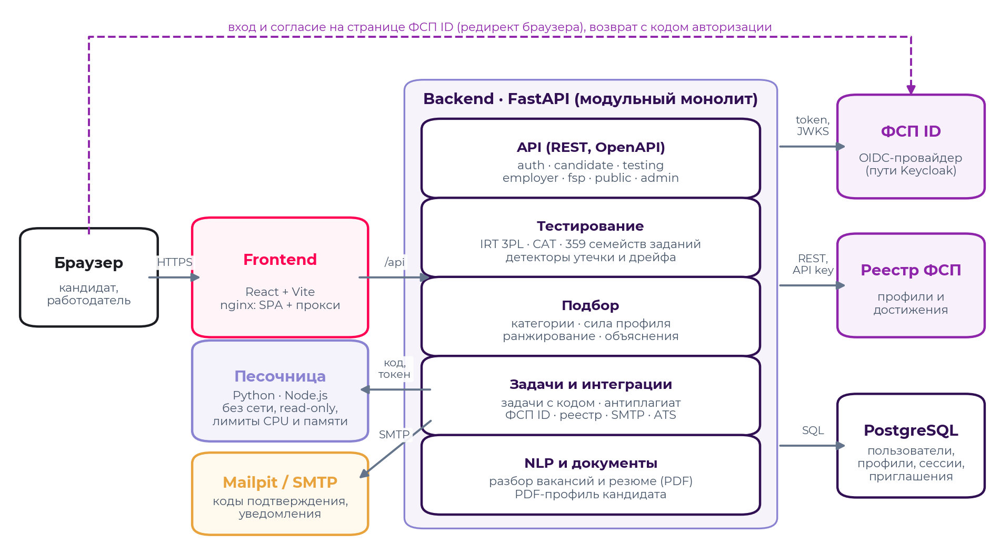

Решение — модульный монолит с явным разделением слоёв, упакованный в Docker. Шесть контейнеров: `frontend` (nginx отдаёт собранное SPA и проксирует `/api` на бэкенд), `backend` (FastAPI), `db` (PostgreSQL 16), `fsp-mock` (OIDC-провайдер «ФСП ID» и реестр достижений с путями Keycloak), `mailpit` (SMTP-сервер для писем с кодами), `sandbox` (песочница для кода кандидатов: без сети и с файловой системой только для чтения; бэкенд обращается к ней через Unix-сокет на общем томе). Суммарный лимит памяти — около 2,5 ГБ.

## 3.2. Компоненты и ответственность

| Компонент | Ответственность | Ключевые файлы |
|---|---|---|
| `api` | REST-роутеры, валидация входных данных (Pydantic), проверка ролей и владельца, коды ошибок | `backend/app/api/*.py` |
| `services/testing` | IRT 3PL, адаптивный алгоритм, банк заданий и генераторы вариантов, детекторы, превью теста по вакансии | `irt.py`, `cat.py`, `bank/`, `integrity.py`, `service.py`, `preview.py` |
| `services/matching` | сила профиля, статусы навыков, рекомендованные категории, ранжирование, объяснения, фильтры | `profile.py`, `ranking.py` |
| `services/nlp` | разбор вакансий (специализация, грейды, навыки, вилка, формат, город), разбор PDF-резюме | `vacancy_parser.py`, `resume_parser.py` |
| `services/fsp` | OIDC-клиент ФСП ID, загрузка участника из реестра, оценка достижений | `client.py`, `scoring.py` |
| `services/pdf` | стандартизированный PDF-профиль кандидата | `profile_pdf.py` |
| `services/sandbox` | исполнение кода кандидата (Python, JavaScript) в изолированном процессе, проверка на тестах работодателя, антиплагиат, сигналы редактора | `runner.py`, `tasks.py`, `antiplagiarism.py` |
| Песочница (контейнер) | HTTP-сервис исполнения кода на Unix-сокете: токен, лимит размера запроса и числа одновременных запусков | `sandbox/server.py`, `sandbox/Dockerfile` |
| `services` (общие) | взаимодействия, регулярные задания, уведомления и аудит, представления кандидата | `interactions.py`, `candidates.py`, `notify.py` |
| `models`, `core` | модели SQLAlchemy, конфигурация, БД, безопасность (Argon2id, JWT, HMAC), почта | `backend/app/models`, `backend/app/core` |
| `seed`, `validation` | демо-данные и синтетическая популяция; процедура валидации и отчёты | `backend/app/seed`, `backend/validation` |
| Frontend | SPA для обеих ролей: React 18, TypeScript, TanStack Query, Tailwind CSS, framer-motion; ленивые маршруты | `frontend/src` |
| ФСП ID (mock) | OIDC-провайдер (RS256, JWKS, PKCE) и реестр достижений по API-ключу | `fsp-mock/app/main.py` |

Ядро тестирования (`irt.py`, `cat.py`, банк заданий) не зависит от базы данных и HTTP, поэтому одно и то же ядро работает в продукте и в симуляциях валидации — метрики раздела 6 получены на рабочем коде, а не на его модели.

## 3.3. Модель данных

| Таблица | Назначение |
|---|---|
| `users` | учётные записи: e-mail, хеш пароля (Argon2id), роль, подтверждение e-mail |
| `email_codes` | коды подтверждения (HMAC), срок действия, число попыток |
| `consents` | журнал согласий: вид, дано или отозвано, время, устройство |
| `notifications`, `audit_log` | уведомления; журнал действий (просмотры карточек, раскрытие контактов, ФСП) |
| `oauth_states` | состояния OIDC: `state`, `nonce`, PKCE-verifier, назначение (привязка или вход), срок 10 минут |
| `candidates` | профиль и основное резюме: контакты, опыт, образование, языки, навыки, ожидания, категория (`grade`, `grade_theta`, `grade_se`), неподтверждённый грейд (`unconfirmed_grade`, θ и дата теста), доменные оценки, статусы навыков, ФСП ID и достижения, сила профиля, приватность |
| `candidate_resumes` | дополнительные резюме: заголовок, навыки, ожидания, «о себе», видимость, ответы опроса и собственная категория с теми же полями, что у профиля |
| `survey_responses`, `grade_history` | история опросов; история присвоения и смены грейда (с привязкой к резюме) |
| `test_sessions`, `test_responses` | сессии теста (резюме, блюпринт, язык, θ, SE, результат, журнал прокторинга); показанные варианты: семейство, seed варианта, ключ, ответ, время |
| `item_stats` | статистика семейств: параметры IRT, показы, наблюдаемая и ожидаемая решаемость, z дрейфа, статус (`active`, `pretest`, `flagged`, `retired`) |
| `companies`, `vacancies` | компании (индекс доверия, URL ATS-webhook); потребности и вакансии со структурированными полями |
| `selections`, `shortlist` | сохранённые подборки (потребность, категории, результат); избранное — по конкретному резюме кандидата |
| `invitations`, `applications` | приглашения с вилкой и снимком объяснения; отклики — оба с привязкой к резюме (категории) |
| `tasks`, `task_assignments`, `complaints` | регулярные задания (для задач с кодом — язык, функция, шаблон, тесты, эталон) и решения (код, результаты прогонов, антиплагиат, сигналы редактора); жалобы на приглашения |

## 3.4. Производительность и масштабирование

Бэкенд не хранит состояние между запросами (сессии теста — в БД, токены — JWT), поэтому масштабируется репликами за балансировщиком. Подборка по пулу до 900 кандидатов ранжируется в среднем за 43 мс (p95 — 75 мс); полный запрос «текст потребности → подборка» в Docker-стенде на 700 кандидатах выполняется за 0,1–0,2 с. Тяжёлые объекты (модель классификации специализаций, NER-модель Natasha, индекс детектора «чужих вариантов») загружаются при старте в фоновом потоке. Фронтенд разделён на ленивые чанки по маршрутам: основной бандл — около 430 КБ. Решение задачи с кодом исполняется в песочнице за 50–80 мс (Python / JavaScript, 4–6 тестов); 30 одновременных отправок обрабатываются за 1,6 с при одном CPU у контейнера песочницы (p95 — 1,5 с), а песочница масштабируется репликами.

<!-- pagebreak -->

# 4. Механика тестирования

## 4.1. Опрос и выбор уровня

Опрос фиксирует ИТ-направление и специализацию — по разъяснению постановщиков, «отрасль» в ТЗ означает направление внутри ИТ, а не индустрию (7 специализаций: Backend, Frontend, Fullstack, Data Science / ML, аналитик данных, DevOps / SRE, QA), — основной язык программирования (Python, Java, Go, JavaScript / TypeScript — в зависимости от специализации), опыт и предполагаемый грейд; предметные области (финтех, ритейл и т. п.) — необязательный вопрос. Грейдов четыре: стажёр, Junior, Middle, Senior. Кандидат сам выбирает уровень теста; рекомендуется заявленный в опросе. Если в профиле есть резюме, система подсказывает грейд по должностям и стажу («Middle — по стажу 3,5 г.»): постановщики допускают такую подсказку, выбор остаётся за кандидатом, а подтверждает грейд только тест.

Специализация задаёт **блюпринт** — доли тестовых доменов. Например, для Backend: алгоритмы 14%, основной язык 22%, SQL 13%, базы данных 10%, HTTP и API 12%, архитектура 12%, безопасность 9%, Linux 4%, CI/CD 4%. Всего в банке 27 доменов.

## 4.2. Банк заданий: семейства и варианты

Единица банка — **семейство заданий**: шаблон с фиксированной темой, уровнем (1–5), типом ответа, ограничением времени и параметрами IRT. Для каждого показа генератор семейства строит **вариант** по seed, выведенному из токена сессии, семейства и номера показа: новые данные, массивы, таблицы, константы, имена; код — на основном языке кандидата. Верный ответ вычисляется самим генератором (для SQL-заданий запрос реально выполняется в SQLite на сгенерированных таблицах), варианты ответов перемешиваются, идентификаторы вариантов случайны.

| Показатель банка | Значение |
|---|---|
| Семейств заданий | 359 по 27 доменам |
| Параметрических (уникальные данные в каждом варианте) | 125 |
| Типы ответа | выбор одного варианта — 238, числовой ответ — 76, ввод ответа — 38, выбор нескольких — 7 |
| Уровни сложности 1–5 | 38 / 93 / 121 / 78 / 29 семейств |
| Время на задание | базовое — по формату: 60–240 с (выбор ответа — 90 с, код и вычисления — 120–240 с); итоговое — с поправкой на трудность: от −20% до +35%, 45–325 с |

Время на ответ не фиксировано: базовое время семейства (зависит от формата) умножается на поправку по трудности b из модели IRT — `t = base × min(1,35; max(0,8; 1 + 0,15·b))`, с округлением до 5 секунд. Лёгкое задание на выбор (b ≈ −1,8) — 70 с, задание средней трудности — 90 с, трудное (b ≈ 1,8) — 115 с; задача с кодом на 240 с базового времени у верхней границы трудности получает 325 с. Таймер и проверка времени — на сервере (запас 15 секунд на сеть).

Почему не «уникальное задание от нейросети каждому»: такая генерация не гарантирует сопоставимую сложность. В семействе меняются данные, но не структура рассуждения, поэтому трудность вариантов одинакова по построению и описывается одними параметрами IRT. Новые семейства — в том числе черновики, подготовленные с помощью LLM и прошедшие ревью эксперта, — входят в банк как пилотные: показываются без влияния на оценку и калибруются по реальным ответам (раздел 4.6).

## 4.3. Модель IRT и оценка уровня

Используется трёхпараметрическая логистическая модель:

```
P(верно | θ) = c + (1 − c) / (1 + exp(−a·(θ − b)))
```

где θ — уровень кандидата на общей шкале, a — дискриминативность задания, b — трудность, c — вероятность угадать (0,25 для выбора из четырёх вариантов, 0 для ввода ответа). Уровень оценивается методом EAP — апостериорное среднее на сетке θ ∈ [−4; 4] с одинаковым для всех кандидатов априорным распределением N(0; 1,25²). Из-за общей шкалы и общего prior результаты кандидатов, получивших разные задания, сопоставимы. Погрешность SE — апостериорное стандартное отклонение.

Грейдам соответствуют полосы шкалы θ с границами −1, 0 и 1: стажёр — ниже −1, Junior — [−1; 0), Middle — [0; 1), Senior — от 1. Процентиль кандидата — Φ(θ) относительно рынка N(0; 1).

## 4.4. Адаптивный алгоритм

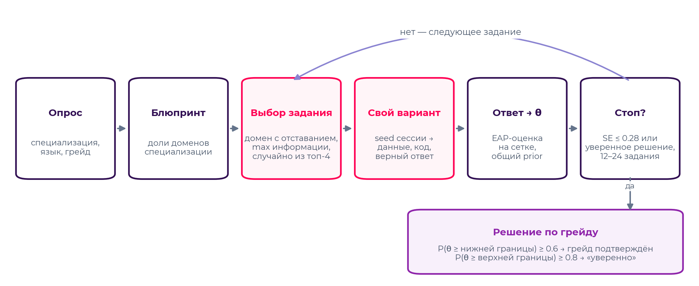

1. **Стартовая точка** — центр заявленного грейда; после первых трёх ответов точка выбора плавно смещается к текущей оценке θ̂ (стартовая точка влияет только на выбор заданий, но не на оценку).
2. **Домен** — тот, что сильнее всего отстаёт от своей доли в блюпринте.
3. **Задание** — среди активных семейств домена, которые кандидат не видел за последние 180 дней и чья доля показов не превышает 30%, берутся четыре с максимальной информацией Фишера I(θ) = a²·(P − c)²/(1 − c)²·(1 − P)/P, и одно из них выбирается случайно (randomesque).
4. **Пилотные задания** — после четырёх рабочих заданий с вероятностью 12% показывается пилотное задание; в оценку оно не входит.
5. **Остановка** — не раньше 12 и не позже 24 рабочих заданий; досрочно, если SE ≤ 0,28 или решение по обеим границам грейда принято с уверенностью 0,92.

| Параметр | Значение | Обоснование |
|---|---|---|
| Длина теста | 12–24 задания, в среднем 20,4 (≈ 20 минут) | баланс точности и времени, подобран симуляцией |
| Порог остановки по SE | 0,28 | точность, достаточная для разделения соседних грейдов |
| Randomesque | случайный выбор из 4 лучших | разнообразие наборов заданий |
| Максимальная экспозиция семейства | 30% | ограничение «популярных» заданий |
| Порог подтверждения грейда | P(θ ≥ нижней границы) ≥ 0,6 | ошибка «завысили грейд» дороже для работодателя, чем «предложили пересдать уровнем ниже» |
| Уверенное подтверждение | P(θ ≥ верхней границы) ≥ 0,8 | тест уровнем выше доступен без месячного ожидания — кандидат начинает его, когда готов |

## 4.5. Решение по грейду и правила пересдачи

По итогам теста выносится одно из трёх решений: «подтверждён», «подтверждён уверенно» (тест уровнем выше становится доступен без ожидания) или «пока не подтверждён». Правила, следующие из ТЗ:

- грейд не понижается принудительно: если тест на более высокий уровень не пройден, текущий грейд сохраняется;
- тест на уровень ниже текущего грейда недоступен — понижать себя не нужно; после неподтверждения доступен тест уровнем ниже заявленного;
- грейд ниже заявленного можно **принять по тому же тесту**, без повторного прохождения, если тест с вероятностью ≥ 0,8 показал уровень не ниже этого грейда: на валидации такое предложение получают 73% неподтвердивших, и оно верно в 99,8% случаев. **Повысить** грейд по тому же тесту нельзя: если бы «уверенный» результат сразу давал следующий грейд, он был бы верен лишь в 73% случаев (ошибка «завысили» дороже для работодателя), поэтому следующий уровень подтверждается отдельным тестом, который кандидат начинает, когда сам будет готов;
- смена грейда — не чаще одного раза в месяц (30 дней; ТЗ оставляет интервал на выбор команды — месяц защищает от перебора попыток и не тормозит рост); повторная попытка того же уровня — тоже через месяц;
- уверенно подтвердившему уровень тест следующего уровня доступен без месячного ожидания, но не начинается сам: кандидат запускает его, когда будет готов, — срока нет, это одна попытка, после неё действуют обычные ограничения;
- любой тест начинается только после подтверждения готовности: кандидат видит длительность, правила прокторинга и ограничения частоты и отмечает «Я готов(а)»;
- при пересдаче кандидат получает другие семейства заданий (виденные за 180 дней исключаются), а внутри семейства — другой вариант;
- незавершённая сессия автоматически закрывается через 3 часа; время ответа контролируется сервером с запасом 15 секунд;
- у каждого резюме (специализации) свои ограничения частоты: смена грейда по DevOps не блокирует тест по Backend; одновременно может идти только один тест;
- если тест не подтвердил грейд, а подтверждённого нет, кандидат не скрывается: до подтверждения он виден работодателям со статусом «не подтверждён» и ниже подтверждённых (раздел 5.1); результат, отправленный на перепроверку (ответы «чужих вариантов»), так не показывается — до повторного теста под наблюдением.

## 4.6. Обоснование устойчивости к распространению заданий

Угроза: задания и ответы расходятся между кандидатами («слитая база»). Защита построена в несколько слоёв, и каждый слой проверен экспериментом (раздел 6.3).

| Угроза | Мера защиты | Эффект |
|---|---|---|
| Ответы из слитой базы | Параметрические варианты: данные и верный ответ уникальны для каждого показа | ответ чужого варианта неверен для своего |
| Списанные ответы | Детектор «чужого варианта»: ответ не подходит к своему варианту, но совпадает с ключом другого варианта того же семейства (вероятность случайного совпадения у отобранных семейств ≤ 2%) | при ≥ 2 таких ответах результат не меняет грейд до повторного теста под наблюдением |
| Заучивание популярных заданий | Адаптивный выбор, randomesque, ограничение экспозиции 30%, исключение виденного за 180 дней | у двух кандидатов одного уровня совпадает лишь 16% вопросов |
| Утечка статичных заданий | Мониторинг дрейфа: если задание систематически решают чаще, чем предсказывает модель (z > 3 при ≥ 30 показах), семейство выводится из ротации | обнаружено 67% утёкших семейств за 1800 прохождений при 0% ложных срабатываний |
| Подставное прохождение, подсказки | Person-fit lz < −2 (несогласованный паттерн ответов) и ≥ 2 верных ответов на трудные задания быстрее 8% лимита времени | сессия помечается для проверки |
| Снимки экрана, печать, копирование заданий | Прокторинг в браузере (раздел 4.8): первое нарушение — предупреждение, второе — досрочное завершение со штрафом к оценке уровня | снимок не помогает (вариант уникален), а повторная попытка снижает собственный результат |
| Устаревание банка | Пилотные задания встраиваются без влияния на оценку и калибруются онлайн методом максимального правдоподобия при фиксированных θ (от 40 ответов) | банк пополняется без потери сопоставимости |

Ключевой результат эксперимента: даже когда нечестный кандидат знает все задания 25 предыдущих кандидатов своей специализации, доля **незамеченного** завышения грейда (13,0%) остаётся на уровне честного прохождения (12,1% — это погрешность измерения), тогда как фиксированный тест в тех же условиях завышают 96,8% нечестных кандидатов.

## 4.7. Профиль по доменам и статусы навыков

По ответам каждого домена считается доменная оценка θ_d (EAP с prior в общей θ̂ — при малом числе заданий оценка сжимается к общей). Навыки, которые домен теста измеряет напрямую (например, SQL, PostgreSQL — доменом «SQL», Docker — доменом «Docker и контейнеры»), получают статус по свидетельствам теста относительно уровня требований вакансии: «подтверждён тестом», «заявлен», «не подтвердился». Знание конкретных инструментов (Kafka, Spring, PyTorch) общий домен не проверяет — такие навыки остаются «заявленными». Основной язык из опроса считается заявленным навыком и проверяется тестом.

## 4.8. Прокторинг: снимки экрана и копирование заданий

Во время теста страница фиксирует действия, которыми задания выносят наружу:

| Событие | Как обнаруживается в браузере | Что происходит |
|---|---|---|
| Снимок экрана | клавиша PrintScreen; сочетания ⌘⇧3/4/5 (macOS); Win+Shift+S — нажатие Win+Shift и следом потеря фокуса окном «Ножниц» | страйк |
| Печать или сохранение страницы | Ctrl/⌘+P, Ctrl/⌘+S, событие `beforeprint`; при печати страница теста скрывается стилями | страйк |
| Копирование текста задания | событие `copy`/`cut` с выделенным текстом задания (текст задания не выделяется, контекстное меню отключено) | страйк; свой ответ копировать можно |
| Уход со вкладки или из окна | `visibilitychange`, `blur` с длительностью отсутствия | учитывается, тест не прерывает; пока окно не активно, задание скрыто размытием |

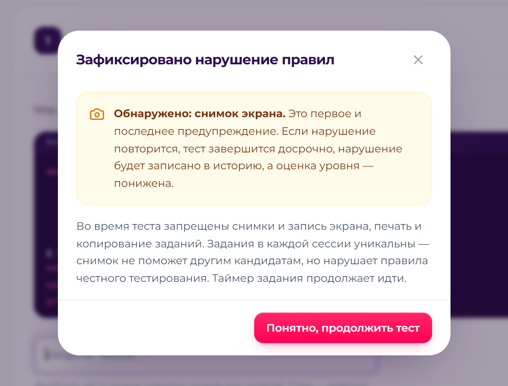

Правило «двух страйков» применяет **сервер** (`POST /testing/sessions/{token}/proctoring`), а не браузер: первое нарушение — модальное предупреждение и отметка в сессии; второе — тест завершается досрочно, задание, на котором зафиксировано нарушение, засчитывается неверным, нарушение записывается в историю тестов, кандидат получает уведомление. Одно действие, пойманное двумя детекторами (клавиша и потеря фокуса), в пределах 3 секунд считается одним страйком.

**Пониженная оценка.** Итог считается по данным ответам со штрафом 0,5 логита (≈ половина ширины грейда): решение принимается по P(θ ≥ нижняя граница + 0,5), процентиль и доменные оценки — по θ − 0,5, «уверенное» подтверждение и досрочное повышение не предлагаются. Если кандидат и со штрафом выше порога грейда, грейд подтверждается: штраф понижает оценку, но не аннулирует реальные знания. Для калибровки заданий и мониторинга дрейфа используется измеренная θ без штрафа, чтобы нарушение кандидата не искажало статистику банка.

**Ограничения и приватность.** Браузер видит не все системные способы снимка (камеру телефона — никогда), поэтому главная защита — уникальные варианты заданий: снимок своего варианта бесполезен другим. Сохраняются только события — вид, время, номер задания, способ обнаружения; содержимое экрана не записывается. Журнал прокторинга входит в выгрузку данных кандидата.

**Что видят работодатель и администратор.** В карточке кандидата рядом с категорией — «Тест пройден без нарушений» (ни одного страйка прокторинга и флага детекторов) или «Оценка снижена за нарушение правил теста»; единичное предупреждение не показывается — это не нарушение. Администратор видит журнал честности (страница «Честность тестов», `GET /admin/integrity`): сессии с нарушениями, предупреждениями и флагами детекторов, сессии на проверке и последние события прокторинга.

<!-- pagebreak -->

# 5. Механика категоризации и подбора

## 5.1. Категория кандидата

Категория — пара «специализация × грейд», где специализация выбрана в опросе, а грейд подтверждён тестом этой специализации. Категорию видит работодатель; именно по категориям строится выдача. Справочник: 7 специализаций × 4 грейда = 28 категорий; смежные специализации (например, Backend и Fullstack, ML и аналитика данных) учитываются при рекомендациях с понижающим коэффициентом.

**Несколько резюме — несколько категорий.** Основное резюме — сам профиль; дополнительные (до двух) — под другие специализации. У каждого резюме свои заголовок, навыки, ожидания по доходу и «о себе», свой опрос, свой тест и своя категория; общие данные — ФИО, контакты, опыт, образование, ФСП, регулярные задания — берутся из профиля. Принцип ТЗ сохраняется: каждая категория подтверждена тестом своей специализации, самоописание категорию не определяет.

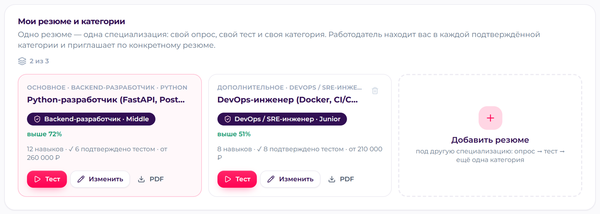

Единица пула подбора — резюме. Для ранжирования дополнительное резюме представлено объектом с тем же набором атрибутов, что у профиля (категория, навыки и ожидания — из резюме, остальное — из профиля), поэтому формула и объяснения одинаковы для всех резюме. Кандидат с несколькими резюме попадает в выдачу **один раз** — с резюме, лучше всего подходящим под потребность; в карточке видны его остальные категории, и работодатель может переключиться между резюме. Приглашение и отклик привязываются к конкретному резюме: кандидат видит, по какой категории его пригласили, а работодатель — с каким резюме кандидат откликнулся. Скрытое кандидатом резюме в подборе не участвует.

**Неподтверждённый грейд.** Постановщики рекомендовали не скрывать кандидата, чей грейд тест не подтвердил, а показывать его со статусом и опускать в выдаче — иначе он выпадает из оборота. Так и сделано. Если тест не подтвердил заявленный грейд, а подтверждённого в этой специализации нет, резюме получает статус «не подтверждён»: сохраняются заявленный грейд, измеренные тестом θ и погрешность, доменные оценки и дата теста. Такое резюме попадает в подборку, если в рекомендованные категории входит заявленный грейд или уровень, который показал тест (например, заявил Middle, тест показал Junior — кандидат виден и в подборках на Junior). Ранжирование — по той же формуле, но совпадение грейда не засчитывается (половина компоненты категории), а вероятность попадания в запрошенные грейды и сила профиля считаются по измеренной θ: при прочих равных такой кандидат всегда ниже подтверждённого. Дополнительный понижающий множитель проверен на валидации и не нужен — любое значение меньше 1 только снижало точность и прятало релевантных кандидатов (раздел 6.4).

Работодатель видит статус в выдаче, банке кандидатов и карточке: «Backend · Middle — не подтверждён», уровень по тесту и процентиль, а в объяснении — «Грейд Middle заявлен, но тестом пока не подтверждён — кандидат показан ниже подтверждённых». В рекомендованных категориях отдельно указано, сколько кандидатов заявили этот грейд без подтверждения; фильтр «только грейды, подтверждённые тестом» убирает их из подборки и поиска, а в банке кандидатов они идут после подтверждённых при любой сортировке. Кандидат видит, что показан со статусом, и может отключить показ в настройках приватности; статус снимается, как только тест подтверждает грейд — например, уровнем ниже, который доступен сразу, или принятием грейда ниже по тому же тесту. Для данных, накопленных до появления статуса, он восстанавливается из истории тестов при старте.

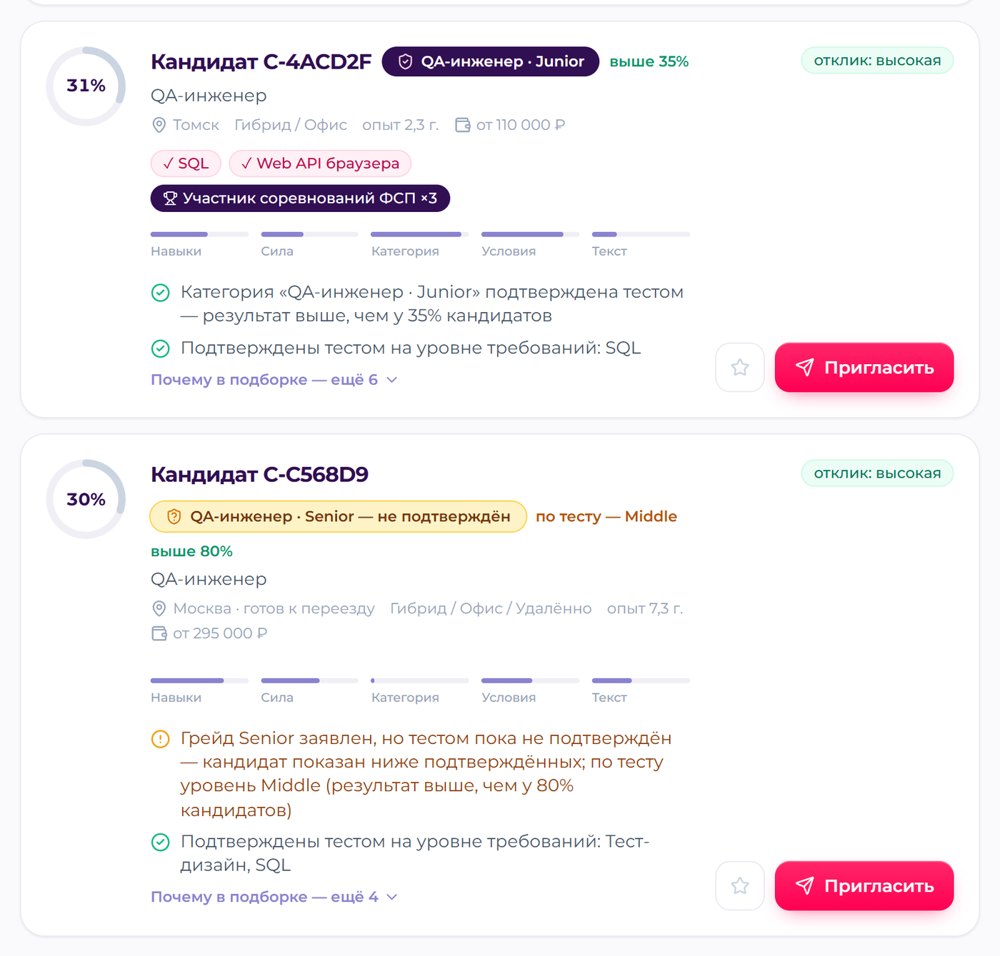

## 5.2. Разбор потребности работодателя (NLP)

Работодатель описывает потребность обычным текстом. Разбор возвращает структурированный запрос, который можно поправить перед подбором:

- **специализация** — гибрид двух моделей: TF-IDF по символьным n-граммам (устойчив к русской морфологии) + логистическая регрессия, обученная на синтетическом корпусе из онтологии навыков и ролевых фраз; и правила по онтологии (вклад найденных навыков и заголовка). Итог — 0,4·модель + 0,6·правила, с уверенностью и альтернативами;
- **грейды** — по явным упоминаниям и опыту; **навыки** — онтология из 105 навыков с синонимами, разделение на обязательные и желательные («будет плюсом»);
- **вилка, формат работы, город** — правила и регулярные выражения. Все суммы на платформе — до вычета НДФЛ (gross): постановщики просили явно подписать, гросс это или нетто. Если в тексте сказано «на руки», сумма пересчитывается по прогрессивной шкале НДФЛ (100 000 ₽ на руки → 115 000 ₽ до вычета), а в интерфейсе вилки и ожидания подписаны «до вычета НДФЛ».

Пример разбора текста «Ищем Python-разработчика уровня Middle в команду платежей. Обязательно: Python, PostgreSQL, Docker, REST API. Будет плюсом: Kafka. Зарплата 200 000 – 280 000 руб., гибрид, Москва.»: специализация Backend (уверенность 0,61), грейд Middle, обязательные навыки Python, PostgreSQL, Docker, REST API, желательный — Kafka, вилка 200–280 тыс. ₽, гибрид, Москва.

## 5.3. Рекомендованные категории и аналитика рынка

Для потребности система рекомендует основную категорию (запрошенные грейды), соседние грейды (ниже — с релевантностью 0,45: «растущий кандидат»; выше — 0,6: «сильнее, чем нужно, но дороже») и смежные специализации. По каждой категории показывается число кандидатов, сколько из них открыты к предложениям, средняя сила профиля, число кандидатов с достижениями ФСП, медиана ожиданий по доходу и доля кандидатов, чьи ожидания укладываются в вилку. Работодатель видит рынок до того, как начнёт приглашать.

## 5.4. Ранжирование

Пул кандидатов — только из рекомендованных категорий, присвоенных тестом. Оценка соответствия:

```
score = (0,30·навыки + 0,25·сила профиля + 0,20·категория + 0,15·условия + 0,10·текст) × доступность
```

| Компонента | Как считается |
|---|---|
| Навыки | среднее по обязательным навыкам: подтверждён тестом — 0,8, заявлен — 0,65, не подтвердился — 0,4, нет в заявленных, но домен уверенно выше уровня требований — 0,3, смежный навык — 0,3, нет данных — 0; итог 0,85·обязательные + 0,15·желательные. Тест отвечает на вопрос «владеет ли кандидат навыком на уровне требований» (нижняя граница запрошенного грейда), а не «насколько он силён» — уровень учитывают категория и сила профиля |
| Сила профиля | 0,6·тест + 0,25·ФСП + 0,15·регулярные задания (раздел 5.5); тестовая часть — положение θ относительно полосы запрошенных грейдов |
| Категория | коэффициент специализации (1 — та же, 0,3–0,6 — смежная) × (½·совпадение грейда + ½·вероятность, что θ кандидата лежит в запрошенных грейдах с учётом погрешности теста); у неподтверждённого грейда совпадения грейда нет — только вероятность по измеренной θ (раздел 5.1) |
| Условия | 0,5·доход + 0,3·формат + 0,2·город: ожидания в вилке — 1, до +15% — 0,5, выше — 0,15; формат и город — совпадение, удалёнка, готовность к переезду |
| Текст | TF-IDF-близость (символьные 3–5-граммы) текста потребности и текстов профиля |
| Доступность | множитель за фактическую недоступность: ожидания заметно выше вилки × 0,6, немного выше × 0,9; другой город без готовности к переезду × 0,5; несовместимый формат × 0,75. Такие кандидаты не исключаются, а опускаются ниже |

Если работодатель отметил, что важен опыт ФСП, кандидаты без привязанного ФСП ID получают мягкое понижение × 0,85, а не исключение. Внутри одной категории порядок определяется силой подтверждённого профиля — выше те, у кого лучше результаты теста и есть достижения ФСП, как требует ТЗ.

## 5.5. Сила профиля и достижения ФСП

```
сила профиля = 0,60·тест + 0,25·ФСП + 0,15·активность
```

- **Тест** — положение θ в полосе грейда: 0,15 + 0,85·(θ − нижняя граница)/(ширина полосы), в пределах [0; 1]. Самоописание в силу профиля не входит.
- **ФСП** — по рекомендациям постановщиков все соревнования и дисциплины равнозначны (внутреннего рейтинга «чемпионат России выше хакатона» нет), учитываются результативность и число соревнований, а роль в команде — нет: FSP ID не гарантирует, кто что делал. Сигнал результата sᵢ = вес × свежесть: победитель 1,0, призёр (2–3-е место) 0,8, финалист (топ-10%) 0,5; результаты агрегируются «шумным ИЛИ» R = 1 − Π(1 − 0,8·sᵢ) — несколько результатов дают больше одного, но счёт насыщается. Участия без результата дают P = min(0,15; 0,05·Σ свежесть): профиль нельзя «набить» онлайн-явками. Итог — R + (1 − R)·P плюс бонус за спортивный разряд (МС 0,10, КМС 0,07, I разряд 0,03), не больше 1; свежесть — период полураспада 3 года. Например, победа в этом году даёт 0,8, двенадцать участий без результата — не больше 0,15.
- **Активность** — решённые регулярные задания: объём (1 − e^(−n/3)) × качество по оценкам работодателей × затухание с периодом полураспада 60 дней.
- **Нет истории ФСП** — сигнал равен 0, это отсутствие бонуса, а не штраф: кандидат остаётся в выдаче на общих основаниях, а в объяснении прямо написано «Нет истории ФСП — на попадание в подборку не влияет».

## 5.6. Объяснения и вероятность отклика

Каждая карточка кандидата в подборке содержит процент соответствия, вклад компонент и причины «за» и «против», например: «Категория „Backend-разработчик · Middle“ подтверждена тестом — результат выше, чем у 62% кандидатов», «Подтверждены тестом на уровне требований: PostgreSQL, REST API», «Заявлены, но тест показал уровень ниже требуемого: …», «ФСП: победитель ×1 · призёр ×1 · соревнований ФСП: 3…», «Ожидания по доходу немного выше вилки (до 15%)», «Другой город и не готов к переезду».

Перед отправкой приглашения работодатель видит оценку вероятности отклика (высокая / средняя / низкая) — логистическая функция от соответствия вилки ожиданиям, формата, города, давности активности и открытости к предложениям — и может пересчитать её для другой вилки.

## 5.7. Подборки, фильтры и поиск по банку

Подборка сохраняется целиком: потребность, рекомендованные категории, ранжированный результат со срезом атрибутов. Фильтры (специализация, грейды, навыки — включая режим «только подтверждённые тестом», наличие достижений ФСП, формат, город с учётом релокации, потолок ожиданий, минимальный процент соответствия) применяются поверх сохранённого результата без пересчёта и без потери исходной подборки; пересчитать подборку на актуальной базе можно отдельной кнопкой. Поиск по всему банку кандидатов доступен отдельно с фильтрами по специализации, грейду, категории, стеку и наличию достижений ФСП. В подборке и банке есть фильтр «только грейды, подтверждённые тестом»; без него кандидаты с неподтверждённым грейдом показываются со статусом и ниже подтверждённых.

## 5.8. Регулярные задания работодателей

Работодатель создаёт короткие задания для категории (специализация и грейды) трёх видов: решить текстом, предложить подход или **задача с кодом** (раздел 5.9). Как рекомендовали постановщики, задания пишет сам работодатель; если есть эталон — проверяет система (задачу с кодом — тестами в песочнице, текстовый ответ — предварительной оценкой близости к эталону), открытые ответы оценивает работодатель. Раз в 7 дней кандидату с присвоенной категорией, открытому к предложениям, предлагается одно новое задание его профиля со сроком 7 дней; можно решить, предложить подход или пропустить. Работодатель выставляет оценку 1–5 с комментарием. Оценки и давность решений входят в силу профиля (компонента активности), а в объяснении появляется «Решено заданий работодателей: N (профиль актуален)».

## 5.9. Задачи с запуском кода в песочнице

**Как работодатель создаёт задачу.** Выбирает язык (Python или JavaScript) и имя функции, пишет условие (Markdown) и шаблон для кандидата, задаёт тесты — аргументы и ожидаемый результат в JSON, открытые (примеры для кандидата) и скрытые, — способ сравнения (точное, числа с допуском 10⁻⁶, или без учёта порядка), лимит времени и эталонное решение. При сохранении эталон прогоняется на всех тестах: если он не проходит, в тестах ошибка, и задача не сохраняется с понятной причиной («тест №3: ожидалось …, получено …»); проверить тесты можно и кнопкой до сохранения. Нужен хотя бы один открытый и хотя бы один скрытый тест.

**Как решает кандидат.** Редактор в браузере с подсветкой, номерами строк и отступами. «Запустить примеры» исполняет код на открытых тестах: видны аргументы, ожидаемый и полученный результат, вывод и ошибки. «Отправить решение» прогоняет все тесты; по скрытым кандидат видит только «пройден / не пройден» — их входы и ответы не раскрываются. Черновик сохраняется при каждом запуске; запуски — не чаще раза в 2 секунды и не более 100 на задание.

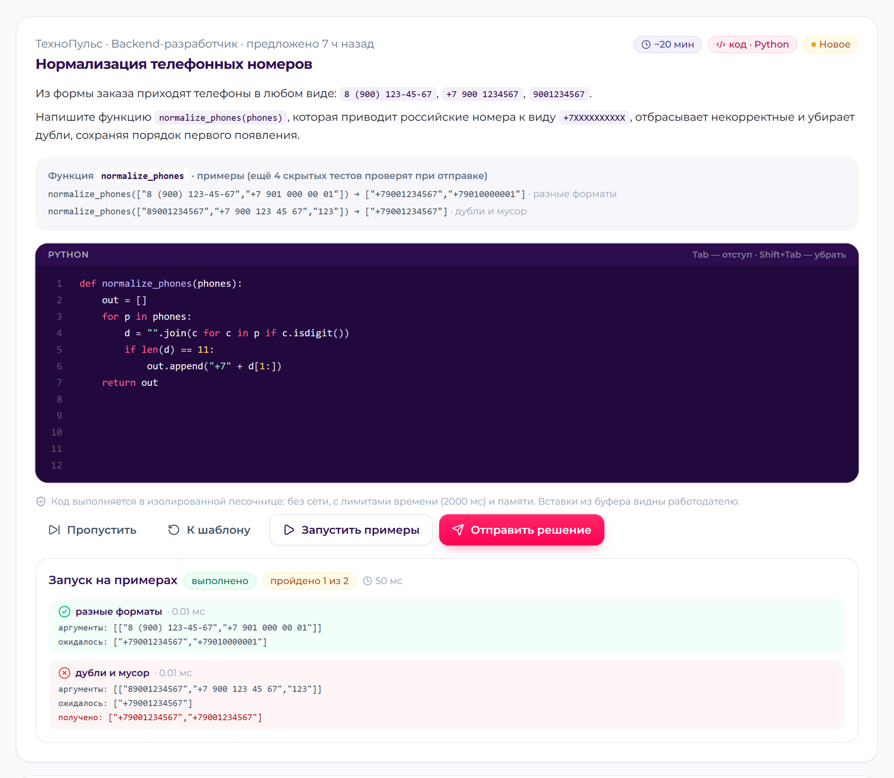

**Как проверяется.** Автооценка — доля пройденных тестов; работодатель видит результаты всех тестов, включая скрытые, код решения и ставит оценку 1–5, которая, как у других заданий, входит в силу профиля. Ожидаемые ответы в песочницу не передаются: она возвращает только значения функции, а сравнение выполняет бэкенд, поэтому код кандидата не может «подсмотреть» ответы скрытых тестов.

**Антиплагиат.** Код превращается в поток токенов, где имена переменных и функций заменены на общий маркер, строки и числа — на маркеры типа, комментарии и форматирование отброшены (в JavaScript — и необязательные фигурные скобки и точки с запятой). По токенам строятся отпечатки 5-грамм с отбором winnowing (окно 4), как в системе MOSS; сходство — доля общих отпечатков от меньшего набора, отпечатки шаблона работодателя вычитаются. При сходстве от 0,85 с решением другого кандидата отметка появляется у обоих решений; отдельно показывается совпадение с эталоном работодателя. На корпусе замаскированных копий и независимых решений порог находит все копии без ложных срабатываний (раздел 6.6).

**Защита от подсказок LLM.** «Распознавать текст нейросети» ненадёжно, поэтому работодатель видит поведенческие сигналы: число вставок из буфера, их размер и долю кода, вставленного целиком, уходы со вкладки, время решения и число запусков. Одинаковые решения разных кандидатов — ещё и признак генерации одной подсказкой LLM, его ловит антиплагиат. Сигналы не штрафуют автоматически: кандидат мог написать код в своей IDE и вставить его — решение о доверии остаётся за работодателем, который видит полную картину.

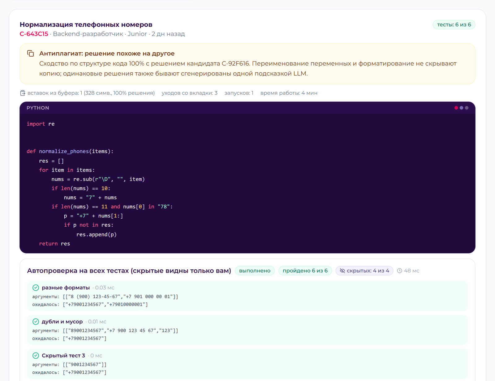

**Изоляция.** Код кандидата исполняется только в отдельном контейнере `sandbox`; каждое свойство проверено запуском враждебного кода в Docker-стенде.

<!-- widths: 17,50,33 -->
| Слой | Мера | Проверено |
|---|---|---|
| Сеть | `network_mode: none` — ни интернета, ни других контейнеров; бэкенд обращается к песочнице через Unix-сокет на общем томе с токеном | запросы в интернет, к бэкенду, к БД и по IP-адресу не проходят |
| Файловая система | корень только для чтения; `/tmp` в памяти (64 МБ) без права просмотра каталога; каждый запуск — во временном каталоге со случайным именем | запись вне `/tmp` и просмотр `/tmp` запрещены |
| Права | отдельный непривилегированный пользователь, все Linux-capabilities сброшены, `no-new-privileges`, чистое окружение без переменных сервиса | — |
| Ресурсы | лимиты ядра на процесс решения: CPU-время, память (256 МБ), размер файлов (1 МБ), открытые файлы (64), число процессов (64); на контейнер — 128 процессов, 512 МБ, 1 CPU; общий таймаут запуска | бесконечный цикл обрывается по таймауту, выделение 1 ГБ — MemoryError |
| Процессы | по окончании запуска завершается вся группа процессов, «сбежавшие» из неё (`setsid`) добиваются, init-процесс контейнера подбирает завершённые | fork-бомба и процесс, ушедший в отдельную сессию, не переживают запуск и не исчерпывают лимит процессов |
| Сервис | токен, лимит размера запроса (256 КБ), не более 2 одновременных запусков на контейнер; код кандидатов не пишется в журналы | — |

Ограничения: внутри одного контейнера запуски разделяют пользователя, поэтому одновременно исполняемое решение теоретически может прочитать файлы соседнего запуска (входы, но не ответы скрытых тестов). Для продуктива — изоляция каждого запуска (gVisor, nsjail или микро-ВМ Firecracker) и пул реплик песочницы; языки — Python и JavaScript, Java и Go — в развитии.

**Демо-данные.** У ТехноПульс (`employer@demo.ru`) — задача «Нормализация телефонных номеров» с тремя решениями синтетических кандидатов: верным, частичным (2 из 6 тестов) и переименованной копией первого с вставкой из буфера — её отмечает антиплагиат. Демо-кандидату (`candidate@demo.ru`) эта задача предложена; у других компаний — задачи по Backend, Frontend (JavaScript) и аналитике данных.

## 5.10. Разбор PDF-резюме

Распознанные поля не сохраняются автоматически: кандидат видит их в окне проверки и применяет к профилю (или к конкретному дополнительному резюме) одной кнопкой.

1. **Извлечение текста с координатами.** pdfminer.six возвращает строки с положением на странице и кеглем; по ним восстанавливается структура документа, а не «сплошной текст».
2. **Экспорт hh.ru.** Документ распознаётся по характерным заголовкам («Желаемая должность и зарплата», «Опыт работы», «Ключевые навыки»). Вёрстка двухколоночная: в левой колонке даты и подписи, в правой — содержание; строки сопоставляются по вертикальным координатам. Имя — самая крупная строка шапки; желаемая должность — крупная строка раздела, затем специализации, зарплата и формат работы; в опыте — период и длительность слева, компания (первая строка) и должность справа; в образовании — год слева, учебное заведение (крупный кегль) и специальность справа; стаж — объединение периодов без двойного счёта пересечений.
3. **Свободные резюме.** Секции по заголовкам — отдельной строкой или «Заголовок: содержание»; склейка перенесённых строк; «Компания, Должность» в строке с датами; уровень и год образования.
4. **Сущности.** Контакты и ссылки (e-mail, телефон, Telegram, GitHub и др.) — регулярными выражениями; ФИО — по позиции и NER-модели Natasha как запасной вариант; навыки — онтология с синонимами: в списке навыков сопоставление полное, в тексте опыта — строгое (без «слабых» синонимов вроде «мониторинг», которые дают ложные срабатывания); софт-скиллы — явные и выведенные из формулировок опыта с цитатой-обоснованием; роли, языки с уровнем, зарплата (указанная «на руки» пересчитывается до вычета НДФЛ, исходная сумма сохраняется), формат, переезд, грейд по стажу и должности, специализация — классификатором раздела 5.2.
5. **Минимизация данных.** Пол, возраст, дата рождения и гражданство не извлекаются и не хранятся.

<!-- pagebreak -->

# 6. Процедура валидации и результаты

## 6.1. Принцип

Эталонной разметки на хакатоне нет, поэтому качество проверяется на **синтетической популяции с известной истиной** — стандартный подход для адаптивных тестов (Monte-Carlo-симуляция CAT). У каждого синтетического кандидата заданы скрытые истинные специализация, уровень θ, доменные способности, навыки, ожидания и география; ответы на задания генерируются моделью IRT по истинным способностям. 35% кандидатов «завышают» резюме: заявляют грейд на ступень выше и добавляют модные навыки. Системы видят только наблюдаемые данные: резюме, ответы на тест, ФСП, условия. Метрики считаются против скрытой истины.

Все эксперименты используют рабочий код продукта (ядро теста, банк заданий, ранжирование, NLP) и воспроизводятся одной командой: `python -m validation.run_all` (около 2 минут). PDF-резюме для проверки парсера генерируются из эталона в двух вёрстках — копия двухколоночного экспорта hh.ru и свободный текст, — так что проверяется вся цепочка «PDF → текст с координатами → поля». Отчёты: `backend/validation/reports/*.json` и `SUMMARY.md`; те же результаты показаны на странице «Методика».

## 6.2. Тестирование: точность, согласованность, дискриминативность

Популяция — 1500 кандидатов.

| Метрика | Значение |
|---|---|
| Корреляция оценки θ̂ с истинным θ / RMSE | 0,921 / 0,43 |
| Средняя длина теста | 20,4 задания (10–90-й перцентили: 12–24) |
| Точность решения «грейд подтверждён» | 82,3% (ложные подтверждения 9,4%, ложные отказы 22,5%) |
| Итоговый грейд совпал с истинным | 64,2% (самооценка в резюме — 56,9%) |
| Грейд в пределах ±1 ступени | 95,0% |
| Завышение грейда | 3,1% (самооценка в резюме — 35,7%) |
| Повторное прохождение (другие задания): тот же грейд | 67,6%; взвешенная κ = 0,801; r(θ̂₁, θ̂₂) = 0,819 |
| Грейд ниже по тому же тесту (P ≥ 0,8): предлагается / верно | 73,3% неподтверждений / 99,8% |
| Если бы «уверенный» результат сразу повышал грейд: верно | 72,9% (48 сессий) — поэтому повышение только отдельным тестом |
| Дискриминативность: медиана индекса D / доля заданий с D ≥ 0,3 | 0,42 / 81,9% (D < 0,2 — 3,6%) |
| Медиана точечно-бисериальной корреляции | 0,355 (параметрические семейства — D = 0,568, статичные — 0,37) |
| Сдвиг оценки по языкам кода (Backend) | Python −0,16, Java −0,14, Go −0,20, JavaScript −0,17 — разброс 0,06 при RMSE 0,38–0,46 |

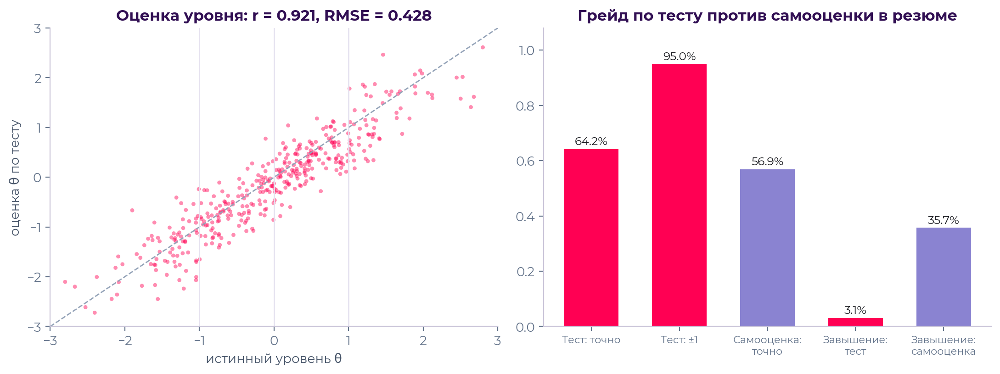

Асимметрия ошибок решения намеренная: порог 0,6 делает ложное подтверждение (9,4%) реже ложного отказа (22,5%). Отказ не понижает грейд и не закрывает путь — кандидат сразу может пройти тест уровнем ниже, — а ложное подтверждение обходится работодателю дороже. Матрица «истинный грейд → присвоенный» показывает, что ошибки сосредоточены у соседних границ и смещены вниз:

| Истинный \ присвоенный | Стажёр | Junior | Middle | Senior | Нет категории |
|---|---|---|---|---|---|
| Стажёр | 163 | 16 | 0 | 0 | 69 |
| Junior | 130 | 334 | 16 | 0 | 4 |
| Middle | 2 | 180 | 302 | 14 | 0 |
| Senior | 0 | 0 | 106 | 164 | 0 |

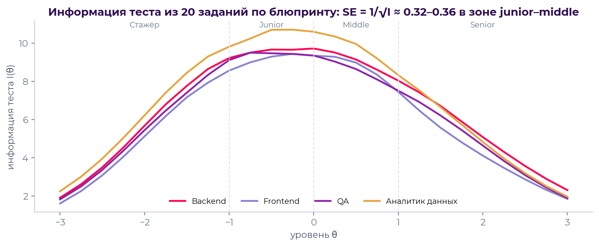

## 6.3. Устойчивость к распространению заданий

**Экспозиция и пересечение.** Используется 95,3% семейств банка; максимальная доля показов одного семейства — 28,3% (95-й перцентиль — 17,6%). У двух кандидатов одного уровня и специализации (худший случай) совпадает 49,2% семейств, но лишь 16,0% вопросов в идентичной форме.

**Атака «слитой базой».** 315 нечестных кандидатов заявляют грейд на ступень выше и знают все задания (с ответами), показанные K предыдущим кандидатам их специализации. Сравниваются три системы: фиксированный тест из 20 статичных заданий, адаптивный тест без параметрических вариантов и наша система.

| Система | Честно (K = 0) | K = 5 | K = 25 | K = 100 |
|---|---|---|---|---|
| Фиксированный тест | 25,7% | 96,8% | 96,8% | 96,8% |
| Адаптивный тест без вариантов | 12,4% | 96,5% | 96,8% | 96,5% |
| ФСП Карьера: завышение | 12,1% | 50,8% | 53,7% | 56,5% |
| ФСП Карьера: незамеченное завышение | 12,1% | 15,6% | 13,0% | 10,8% |
| ФСП Карьера: доля помеченных сессий | 0,6% | 71,7% | 81,0% | 82,2% |

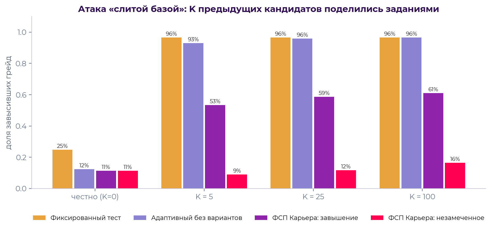

Списывание из базы срабатывает только на статичных заданиях; на параметрических оно оставляет «чужие» ответы, и детектор помечает 72–82% таких сессий при 0,6% ложных пометок у честных. Помеченный результат не меняет грейд до повторного теста под наблюдением, поэтому **незамеченное** завышение остаётся на уровне честного прохождения.

**Обнаружение утечки статичных заданий.** Сценарий: в Backend / Python утекли 12 самых популярных статичных семейств, их знают 20% кандидатов. Доля выявленных утёкших семейств (TPR) при пороге z > 3: после 300 прохождений — 8%, 900 — 42%, 1500 — 50%, 1800 — 67% (при пороге z > 2,5 — 83% за 1800 прохождений); ложных срабатываний (FPR) — 0% во всех точках. Выявленное семейство заменяется, результаты кандидатов не аннулируются.

**Ошибки калибровки.** Если априорные параметры заданий неточны (b ± 0,4, a × e^N(0; 0,25)), точность грейда снижается умеренно: 71,9% против 73,9% у «оракула» с истинными параметрами. Онлайн-калибровка по рабочим ответам снижает ошибку трудности с 0,391 до 0,287 и возвращает точность грейда до 73,0%.

## 6.4. Подбор

900 кандидатов, 60 потребностей разных специализаций и грейдов. Релевантность пары «потребность — кандидат» (метка 0–3) задаётся скрытой истиной: специализация, грейд, владение обязательными навыками, ожидания по доходу и география; релевантен — метка ≥ 2 (в среднем 26 релевантных кандидатов на потребность). Сравниваются поиск по ключевым словам (TF-IDF по резюме, как на универсальных площадках), классические фильтры по самоописанию (специализация, заявленный грейд, зарплата, город, ранжирование по покрытию заявленных навыков) и наша система, а также её абляции.

| Система | P@10 | nDCG@10 | MRR | Нерелевантных в топ-10 | «Завысивших себя» в топ-10 |
|---|---|---|---|---|---|
| Поиск по ключевым словам | 0,270 ± 0,041 | 0,272 | 0,439 | 46,0% | 9,8% |
| Фильтры по самоописанию | 0,750 ± 0,048 | 0,800 | 0,901 | 2,7% | 20,7% |
| **ФСП Карьера** | **0,835 ± 0,040** | **0,822** | **0,956** | 3,8% | **2,8%** |
| ФСП Карьера, потребность из текста (NLP) | 0,835 ± 0,040 | 0,822 | 0,964 | 4,0% | 2,7% |
| Абляция: категория из самоописания | 0,717 ± 0,050 | 0,748 | 0,871 | 4,8% | 19,8% |
| Абляция: без ФСП | 0,840 ± 0,039 | 0,825 | 0,956 | 3,7% | 2,8% |
| Абляция: без проверки навыков тестом | 0,855 ± 0,039 | 0,852 | 0,967 | 2,8% | 2,7% |

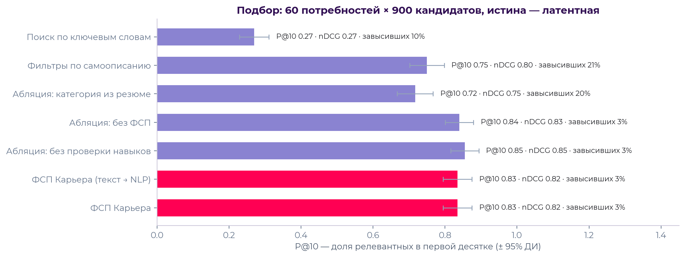

Выводы:

- категория по тесту — главный источник качества: замена её на самоописание снижает P@10 с 0,835 до 0,717 и в 7 раз увеличивает долю «завысивших себя» в топ-10 (19,8% против 2,8%);
- сквозной сценарий «текст вакансии → NLP → подборка» не теряет в P@10 по сравнению со структурированным запросом (0,835 в обоих случаях);
- вклад ФСП в синтетике в пределах шума (0,840 без ФСП против 0,835): достижения есть у меньшинства кандидатов и коррелируют с уровнем, который уже измерен тестом. Поэтому ФСП в системе — бонус к силе профиля и аргумент в объяснении, а не фильтр; реальный вклад — предмет пилота;
- проверка навыков тестом не меняет P@10 значимо (0,835 против 0,855, в пределах доверительного интервала ±0,04): в синтетике резюме честно перечисляют 92% навыков. Её ценность — в объяснимости («подтверждён тестом / не подтвердился») и в защите от навыков, заявленных для вида. В ходе валидации отвергнут вариант с непрерывной шкалой владения навыком: он повторно учитывал уровень θ и поднимал переквалифицированных кандидатов (P@10 0,828);
- среднее время ранжирования пула до 900 кандидатов — 43 мс (p95 — 75 мс).

**Неподтверждённые грейды: скрывать или показывать ниже.** В основной симуляции кандидат после неподтверждения сразу проходит тест уровнем ниже, поэтому без категории остаётся мало кандидатов. В жизни так делают не все: в этом эксперименте половина кандидатов после неподтверждения не пересдаёт сразу (допущение). Без категории оказывается 220 из 900 кандидатов: у 80 истинный уровень такой, как заявлен (тест ошибся — ложный отказ), у 139 — ниже заявленного. Сравниваются прежнее поведение (скрывать), показ со статусом и разными понижающими множителями и строгий показ после всех подтверждённых.

| Вариант | P@10 | nDCG@10 | Нерелевантных в топ-10 | «Завысивших себя» в топ-10 | Неподтверждённых в топ-10 | Релевантные неподтверждённые в топ-20 |
|---|---|---|---|---|---|---|
| Скрывать (как было) | 0,810 ± 0,045 | 0,809 | 4,8% | 2,3% | 0% | 0% |
| **Показывать со статусом (продукт)** | **0,822 ± 0,045** | **0,820** | **3,7%** | **2,0%** | 3,8% | **29,6%** |
| Показывать, множитель 0,85 | 0,813 ± 0,045 | 0,812 | 4,3% | 2,3% | 1,0% | 13,6% |
| Показывать, множитель 0,7 | 0,808 ± 0,046 | 0,808 | 5,0% | 2,3% | 0% | 6,2% |
| Строго после всех подтверждённых | 0,808 ± 0,046 | 0,808 | 5,0% | 2,3% | 0% | 0% |

Показ со статусом не ухудшает выдачу, а немного улучшает её: нерелевантных и «завысивших себя» в топ-10 меньше, потому что ранжирование идёт по измеренной θ — завысивший грейд кандидат оказывается рядом со своим истинным уровнем, а не с заявленным. Почти треть релевантных кандидатов, которых прежнее поведение прятало полностью, попадает в топ-20. Дополнительный понижающий множитель лишь возвращает потери: разница P@10 в пределах доверительного интервала, а релевантные кандидаты пропадают из видимой части выдачи. Поэтому понижение ограничено отсутствием совпадения грейда (раздел 5.1). Множитель 0,55 и 0,4 дают тот же результат, что строгий порядок; полная таблица — в отчёте валидации.

## 6.5. NLP

| Задача | Набор | Результат |
|---|---|---|
| Специализация вакансии | 28 текстов, размеченных командой | 100% (только модель — 96,4%, только правила — 100%) |
| Грейды / вилка / формат / город вакансии | те же 28 текстов | 100% / 100% / 100% / 92,9% |
| Навыки вакансии | те же 28 текстов | точность 0,953, полнота 0,977, F1 0,961; желательные навыки распознаны в 87,5% |
| Резюме из PDF: 19 полей — ФИО, e-mail, телефон, Telegram, GitHub, город, переезд, желаемая должность и зарплата, формат, стаж, число мест работы, компания, должность, даты, вуз, год окончания, языки, «о себе» | 80 синтетических PDF: 40 — двухколоночная вёрстка экспорта hh.ru, 40 — свободный текст | 100% по каждому полю в обоих форматах; средняя ошибка стажа 0,015 года |
| Резюме: навыки | те же 80 PDF | F1 0,957 (hh.ru — 0,943, свободный текст — 0,971) |

## 6.6. Антиплагиат задач с кодом

Вопрос: отделяет ли порог сходства 0,85 копии от независимых решений той же задачи? Корпус — четыре демо-задачи (Python и JavaScript). Для каждой есть эталон и независимые решения другого подхода или стиля (в том числе частично верное) — 19 пар, — и 6 «замаскированных копий»: переименование переменных, другие комментарии и форматирование, фигурные скобки вокруг одиночных операторов; одна копия дополнительно разбавлена неиспользуемой функцией и вызовами логирования. Каждое решение сначала исполняется в песочнице на тестах задачи — корпус проверен на корректность. Воспроизведение: `python -m validation.plagiarism_validation`.

| Параметры (k-грамма, окно) | Найдено копий | Мин. сходство копий | Ложных срабатываний | Макс. сходство независимых |
|---|---|---|---|---|
| 4, 4 | 5 из 6 | 0,826 | 1 из 19 | 0,864 |
| **5, 4 (выбрано)** | **6 из 6** | **0,857** | **0 из 19** | **0,600** |
| 6, 4 | 5 из 6 | 0,783 | 0 из 19 | 0,739 |

При выбранных параметрах переименование, комментарии и форматирование не снижают сходство копии ниже 1,0; разбавление неиспользуемым кодом — до 0,857, у самого порога: развёрнутая переработка решения антиплагиатом не ловится, поэтому рядом показаны сигналы редактора. Независимые решения одной задачи сходны не более чем на 0,6 — запас до порога велик. Параметры выбраны перебором на этом же небольшом корпусе (перебор целиком — в отчёте `plagiarism_validation.json`); на реальных решениях порог нужно перепроверить.

## 6.7. Ограничения и план валидации на реальных данных

- Эталон синтетический: проверяются свойства процедур при известной истине. Выводы зависят от допущений генератора — они явно описаны в коде (`backend/app/seed/synthetic.py`) и могут быть оспорены и изменены.
- Тексты вакансий для проверки NLP написаны командой; перед запуском нужна проверка на выборке реальных вакансий.
- План пилота с ФСП: 1) 100–200 участников проходят тест, эксперты ФСП независимо оценивают грейд по интервью — согласие теста с экспертами (κ) и калибровка порогов; 2) повторное прохождение через 2–4 недели — устойчивость грейда; 3) онлайн-калибровка параметров заданий на реальных ответах; 4) работодатели-партнёры размечают релевантность топ-20 подборок — P@10 и nDCG на реальных парах; 5) A/B-сравнение конверсии приглашений в принятие с базовыми фильтрами.

<!-- pagebreak -->

# 7. Интеграция с реестром ФСП

## 7.1. Схема взаимодействия

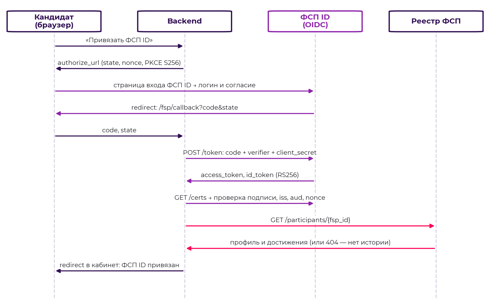

Кандидат нажимает «Привязать ФСП ID» (или «Войти через ФСП ID» на странице входа). Бэкенд создаёт состояние авторизации (`state`, `nonce`, PKCE-verifier, срок 10 минут) и перенаправляет браузер на страницу входа ФСП ID. После входа и согласия провайдер возвращает код авторизации на `/api/v1/fsp/callback`. Бэкенд обменивает код на токены (с PKCE-verifier и секретом клиента), проверяет подпись `id_token` по ключам JWKS, издателя, аудиторию и `nonce`, извлекает ФСП ID и запрашивает участника в реестре. Достижения сохраняются в профиле, сила профиля пересчитывается.

## 7.2. Протокол OpenID Connect

Пути эндпоинтов совпадают с Keycloak, поэтому подключение к реальному ФСП ID на базе Keycloak сводится к смене адреса издателя и учётных данных клиента.

| Назначение | Эндпоинт провайдера |
|---|---|
| Метаданные | `GET /realms/fsp/.well-known/openid-configuration` |
| Авторизация | `GET /realms/fsp/protocol/openid-connect/auth` (`response_type=code`, `scope=openid profile email`, `code_challenge_method=S256`) |
| Токены | `POST /realms/fsp/protocol/openid-connect/token` (`grant_type=authorization_code`, `code_verifier`) |
| Ключи подписи | `GET /realms/fsp/protocol/openid-connect/certs` (JWKS, RS256) |
| Профиль | `GET /realms/fsp/protocol/openid-connect/userinfo` |

Меры безопасности: PKCE S256, одноразовый `state` с ограниченным сроком, проверка `nonce`, проверка подписи и `iss`/`aud`/`exp` у `id_token`, один ФСП ID — один профиль (повторная привязка к другому профилю отклоняется), секрет клиента хранится только на бэкенде. Идентификатор участника берётся из клейма `fsp_id`, при его отсутствии — из `preferred_username` или `sub`.

Вход через ФСП ID: если профиль с этим ФСП ID уже есть — выполняется вход; если нет — создаётся учётная запись кандидата с e-mail, подтверждённым провайдером, и фиксируется согласие на обработку данных.

## 7.3. Данные реестра

Реестр отдаёт участника по ФСП ID: `GET /registry/api/v1/participants/{fsp_id}` (сервисный ключ `X-API-Key` или access-токен самого участника) и поиск `GET /registry/api/v1/participants?q=` (только сервисный ключ). Набор данных выбран так, чтобы работодатель мог проверить каждое достижение.

| Поле | Описание |
|---|---|
| `fsp_id`, `full_name`, `email`, `region`, `birth_year` | идентификация участника |
| `sport_rank` | спортивный разряд (МС, КМС, I разряд) |
| `rating.points`, `rating.season` | рейтинг участника в сезоне |
| `achievements[].event_id`, `event`, `date` | соревнование и дата |
| `achievements[].discipline` | дисциплина: продуктовое, алгоритмическое программирование, системы ИБ, беспилотные авиационные системы, робототехника |
| `achievements[].level` | уровень: региональный, межрегиональный, всероссийский, международный |
| `achievements[].place`, `participants` | место и число участников (для расчёта «финалист, топ-10%») |
| `achievements[].team`, `role` | команда и роль в команде (капитан, участник) |
| `achievements[].result_url`, `verified` | ссылка на протокол результатов; признак подтверждения ФСП |

Работодателю достижения показываются компактно: заголовок («Призёр всероссийского чемпионата…»), лучший результат с местом и годом, список с дисциплинами и ссылками на протоколы. Кандидат может скрыть достижения настройками приватности.

## 7.4. Кандидат без истории ФСП

Возможны три случая, все обрабатываются явно: ФСП ID не привязан; привязан, но в реестре нет участника (404) — профиль привязан с пустым списком достижений; участник есть, но без достижений. Во всех случаях сигнал ФСП равен 0: кандидат попадает в подборки на общих основаниях, а в объяснении написано «Нет истории ФСП — на попадание в подборку не влияет, бонус не начислен» или «ФСП ID привязан, достижений в реестре пока нет». Абляция подтверждает, что отсутствие ФСП-компоненты почти не меняет качество выдачи (раздел 6.4), то есть система не дискриминирует кандидатов без соревновательного опыта.

## 7.5. Переход на реальный ФСП ID и реестр

1. Зарегистрировать в Keycloak ФСП клиента `fsp-career` (confidential, Standard Flow, PKCE S256), redirect URI `https://<домен>/api/v1/fsp/callback`.
2. Добавить в токен клейм `fsp_id` (mapper атрибута пользователя) — либо использовать `preferred_username`.
3. Указать переменные окружения `FSP_PUBLIC_ISSUER=https://<keycloak>/realms/<realm>`, `FSP_CLIENT_SECRET`, `FSP_REGISTRY_URL`, `FSP_REGISTRY_API_KEY`; mock-сервис из состава стенда исключить.
4. Согласовать с ФСП контракт реестра (раздел 7.3) или адаптер к существующему API — изменения локализованы в `backend/app/services/fsp/client.py`.
5. Синхронизация: при привязке, по кнопке «Обновить достижения» и, в развитии, по событиям реестра (webhook о новых протоколах).

<!-- pagebreak -->

# 8. Описание API

## 8.1. Общие сведения

- Базовый путь — `/api/v1`; формат — JSON (UTF-8); загрузка резюме — `multipart/form-data` (PDF до 5 МБ).
- Спецификация OpenAPI генерируется автоматически: Swagger UI — `/docs`, ReDoc — `/redoc`, JSON — `/openapi.json`. Для каждого эндпоинта описаны параметры, схемы запросов и ответов, коды ошибок и примеры.
- Аутентификация — `Authorization: Bearer <JWT>`; токен выдаётся при входе по паролю или через ФСП ID, срок действия — 12 часов. Кнопка Authorize в Swagger поддерживает OAuth2 password flow.
- Ошибки — `{"detail": "текст"}`; ошибки валидации — код 422 с перечнем полей. Основные коды: 400 — некорректный запрос, 401 — нет или истёк токен, 403 — недостаточно прав, 404 — не найдено или чужой объект, 409 — конфликт состояния (например, активное приглашение уже есть), 413 — файл слишком большой, 429 — превышен лимит попыток или приглашений.

## 8.2. Примеры

Вход и получение токена:

```
POST /api/v1/auth/login
{"email": "employer@demo.ru", "password": "demo12345"}

200 OK
{"access_token": "eyJhbGciOiJIUzI1NiIs…", "token_type": "bearer",
 "user": {"id": 324, "email": "employer@demo.ru", "role": "employer",
          "email_verified": true}}
```

Разбор потребности:

```
POST /api/v1/employer/vacancies/parse
{"text": "Ищем Python-разработчика уровня Middle в команду платежей. Обязательно:
          Python, PostgreSQL, Docker, REST API. Будет плюсом: Kafka.
          Зарплата 200 000 – 280 000 руб., гибрид, Москва."}

200 OK
{"specialization": "backend", "specialization_confidence": 0.608, "grades": ["middle"],
 "must_skills": ["python", "postgresql", "docker", "rest"], "nice_skills": ["kafka"],
 "salary_from": 200000, "salary_to": 280000, "work_format": "hybrid", "city": "Москва", …}
```

Подборка (ответ сокращён):

```
POST /api/v1/employer/selections
{"text": "<текст потребности>", "title": "Python-разработчик (платежи)"}

201 Created
{"id": 12, "need": {…}, "total": 78,
 "categories": [{"specialization": "backend", "grade": "middle", "primary": true,
                 "count": 18, "with_fsp": 3, "median_salary": 250000,
                 "share_in_budget": 0.72, …}, …],
 "results": [{"public_id": "C-346E6B", "match": 51, "grade": "middle",
              "components": {"skills": 0.33, "strength": 0.28, "category": 0.93,
                             "conditions": 0.94, "text": 0.14},
              "reasons": [{"kind": "plus",
                           "text": "Категория «Backend-разработчик · Middle» подтверждена тестом…"}, …],
              "likelihood": {"p": 0.88, "label": "высокая"}}, …]}
```

Приглашение (вилка обязательна; привязка к вакансии — нет):

```
POST /api/v1/employer/invitations
{"candidate_id": 57, "title": "Backend-разработчик в платёжную команду",
 "message": "Развиваем платёжный шлюз на Python и PostgreSQL…",
 "salary_from": 220000, "salary_to": 280000, "work_format": "hybrid",
 "contact_method": "Telegram @techpulse_hr"}

201 Created — приглашение со статусом "sent";
409 — у кандидата уже есть ваше активное приглашение / вилка ниже его ожиданий;
429 — достигнут суточный лимит приглашений
```

Ответ кандидата: `POST /api/v1/candidate/invitations/{id}/accept` открывает контакты обеим сторонам; `POST /api/v1/candidate/invitations/{id}/decline` с телом `{"reason": "salary", "comment": "…"}` закрывает приглашение с причиной.

## 8.3. Перечень эндпоинтов

Все пути указаны относительно `/api/v1`. Полная спецификация с схемами — в Swagger (`/docs`); таблица сгенерирована из неё скриптом `docs/gen_api_table.py`.

<!-- widths: 17,9,27,31,10,6 -->
<!-- include: api_endpoints.md -->

<!-- md-only -->
Полный перечень: [api_endpoints.md](api_endpoints.md).

<!-- pagebreak -->

# 9. Безопасность, персональные данные и защита от злоупотреблений

## 9.1. Персональные данные (152-ФЗ)

- Согласие на обработку персональных данных — обязательное условие регистрации; согласие на публикацию профиля работодателям — отдельное. Каждое согласие и его отзыв фиксируются в журнале с датой и устройством; отзыв согласия на публикацию скрывает профиль из банка кандидатов. Отдельная настройка — показываться ли работодателям, пока грейд не подтверждён тестом (по умолчанию да, со статусом и ниже подтверждённых).
- Принцип минимизации: работодатель до контакта видит анонимный код и профессиональные данные; контакты — только после принятия приглашения или собственного отклика кандидата.
- Кандидат может выгрузить все свои данные (`GET /candidate/export`) и удалить аккаунт с персональными данными (`DELETE /candidate/account`).
- Прокторинг теста не записывает содержимое экрана: сохраняются только события (вид, время, номер задания), они входят в выгрузку данных.
- Все просмотры карточек и раскрытия контактов журналируются; кандидат видит число просмотров своего профиля, работодатель — историю своих просмотров.
- Для продуктива: размещение в РФ, шифрование дисков и резервных копий, регламент хранения журналов, уведомление Роскомнадзора об обработке ПДн.

## 9.2. Аутентификация и авторизация

- Пароли — Argon2id; коды подтверждения e-mail — 6 цифр, хранятся только как HMAC-SHA256, действуют 30 минут, не более 5 попыток ввода.
- JWT HS256 со сроком 12 часов; секрет задаётся переменной окружения.
- Ограничение частоты: вход — 8 попыток за 5 минут на e-mail, повторная отправка кода — 3 за 2 минуты (в продуктиве — общий лимитер на Redis).
- Разграничение прав по ролям (кандидат, работодатель, администратор) на уровне зависимостей FastAPI; проверка владельца объекта на каждом запросе — чужой объект неотличим от несуществующего (404).
- Бэкенд в контейнере работает от непривилегированного пользователя; CORS ограничен адресами фронтенда; секреты — только в переменных окружения.
- Код кандидатов исполняется только в контейнере песочницы без сети (раздел 5.9); ответы скрытых тестов в неё не передаются.

## 9.3. Защита кандидатов от недобросовестных работодателей

- Суточный лимит приглашений на компанию (60) и запрет повторного приглашения при активном — защита от массовых рассылок.
- Индекс доверия компании: растёт при подтверждении домена (e-mail сотрудника совпадает с доменом сайта компании), снижается при жалобах кандидатов; показывается кандидату вместе с приглашением.
- Жалоба на приглашение (фиктивная вакансия, спам, несоответствие вилки, некорректное общение) — с понижением индекса доверия и основанием для модерации.
- Кандидат может не принимать предложения с вилкой ниже своих ожиданий; вилка всегда видна до начала общения.
- Развитие: модерация вакансий с высоким риском (аномальная вилка, массовые приглашения), верификация компании по ИНН через открытые реестры, блокировка при повторных жалобах.

## 9.4. Интеграция с ATS работодателя

В профиле компании задаётся URL webhook; при принятии приглашения и при отклике на вакансию платформа отправляет событие (`invitation.accepted`, `application.created`) с контактами кандидата — в обоих случаях они уже раскрыты компании по правилам видимости. Концепция развития: подпись событий HMAC и повторные попытки с очередью, двусторонняя синхронизация статусов (интервью, оффер, найм) через REST API, готовые коннекторы к распространённым ATS (Huntflow, Talantix, «Поток»), выгрузка стандартизированного PDF-профиля в карточку кандидата ATS.

<!-- pagebreak -->

# 10. Используемые модели, библиотеки и компоненты

## 10.1. Модели и LLM

| Модель | Где используется | Как устроена |
|---|---|---|
| IRT 3PL + EAP (собственная реализация на NumPy) | оценка уровня, адаптивный выбор заданий, калибровка банка | параметры заданий — априорные с онлайн-калибровкой по ответам |
| TF-IDF по символьным n-граммам + логистическая регрессия (scikit-learn) | специализация вакансии и резюме | обучается при старте за секунды на синтетическом корпусе из онтологии навыков |
| TF-IDF-близость | текстовая компонента ранжирования, предварительная оценка текстовых ответов | без обучения |
| Natasha (NER) | имена в резюме — запасной вариант к разбору по вёрстке | локальная модель, CPU |
| Антиплагиат (токены + winnowing) | задачи с кодом | алгоритм без обучения, раздел 5.9 |

**LLM в рабочем контуре не используются.** Разбор вакансий и резюме, ранжирование, объяснения и проверка решений работают на локальных моделях и правилах — без GPU, без внешних API и без передачи персональных данных за пределы стенда, поэтому вопрос трансграничной передачи не возникает, а результат воспроизводим. Где LLM полезна в развитии и как её подключить, не рискуя объективностью: черновики новых семейств заданий и тестов к задачам с кодом — российская модель (GigaChat или YandexGPT) через API, без персональных данных; черновик проходит ревью эксперта, автотест генератора и калибровку как пилотное задание, поэтому не влияет на оценки, пока не откалиброван. Защита от LLM на стороне кандидата — уникальные варианты и время по трудности в тесте (раздел 4), антиплагиат и сигналы редактора в задачах с кодом (раздел 5.9).

## 10.2. Библиотеки и компоненты

Все компоненты — открытое ПО под разрешительными лицензиями. Точные версии зафиксированы в `backend/requirements.txt`, `fsp-mock/requirements.txt` и `frontend/package-lock.json`.

| Компонент | Версия | Назначение | Лицензия |
|---|---|---|---|
| Python | 3.11 | среда бэкенда | PSF |
| FastAPI | 0.142.2 | REST API, OpenAPI | MIT |
| Starlette | 1.7.0 | ASGI-фреймворк | BSD-3 |
| Uvicorn | 0.54.0 | ASGI-сервер | BSD-3 |
| Pydantic / pydantic-settings | 2.13.5 / 2.15.0 | схемы и конфигурация | MIT |
| email-validator | 2.3.0 | проверка e-mail | Unlicense |
| python-multipart | 0.0.32 | загрузка файлов | Apache-2.0 |
| SQLAlchemy | 2.1.3 | ORM | MIT |
| psycopg (binary) | 3.3.6 | драйвер PostgreSQL | LGPL-3.0 |
| PyJWT / cryptography | 2.15.1 / 50.0.2 | JWT, проверка RS256 | MIT / Apache-2.0, BSD |
| argon2-cffi | 25.1.0 | хеширование паролей | MIT |
| httpx | 0.28.1 | HTTP-клиент (ФСП ID, реестр, ATS) | BSD-3 |
| NumPy / SciPy | 2.4.6 / 1.17.1 | IRT, вычисления | BSD-3 |
| scikit-learn | 1.9.1 | TF-IDF, логистическая регрессия | BSD-3 |
| Natasha | 1.6.0 | NER для разбора резюме | MIT |
| pdfminer.six | 20260107 | извлечение текста из PDF | MIT |
| ReportLab | 5.0.1 | генерация PDF-профиля | BSD |
| pytest | 9.1.1 | тесты | MIT |
| Jinja2 | 3.1.6 | страница входа ФСП ID (mock) | BSD-3 |
| React / React DOM | 18.3.1 | интерфейс | MIT |
| React Router | 6.30.6 | маршрутизация | MIT |
| TanStack Query | 5.104.1 | работа с API и кэш | MIT |
| Tailwind CSS | 3.4.19 | стили | MIT |
| framer-motion | 11.18.2 | анимации | MIT |
| Recharts | 2.15.4 | графики | MIT |
| lucide-react | 1.52.0 | иконки | ISC |
| react-markdown / remark-gfm | 9.1.0 / 4.0.1 | отображение текстов заданий | MIT |
| prism-react-renderer | 2.4.1 | подсветка кода в заданиях | MIT |
| clsx | 2.1.1 | классы | MIT |
| Шрифт Montserrat (@fontsource) | 5.3.0 | фирменная типографика | OFL-1.1 |
| TypeScript / Vite | 5.9.3 / 5.4.21 | сборка фронтенда | Apache-2.0 / MIT |
| PostCSS / Autoprefixer | 8.5.28 / 10.6.1 | обработка CSS | MIT |
| PostgreSQL | 16 (alpine) | СУБД | PostgreSQL License |
| nginx | 1.27 (alpine) | раздача SPA, обратный прокси | BSD-2 |
| Node.js | 22 (alpine) | сборка фронтенда в Docker | MIT |
| Node.js (песочница) | 20 (пакет Debian) | исполнение JavaScript-решений | MIT |
| docker-init (tini) | встроен в Docker | init-процесс контейнера песочницы | MIT |
| Mailpit | latest | SMTP-сервер стенда | MIT |

<!-- pagebreak -->

# 11. Сборка, развёртывание и запуск

## 11.1. Запуск в Docker (рекомендуется)

Требования: Docker Desktop или Docker Engine с Compose v2, свободные порты 8080, 8000, 8090, 8025, около 2,5 ГБ оперативной памяти.

1. Получите код: `git clone <адрес репозитория>` и перейдите в папку проекта.
2. При необходимости скопируйте `.env.example` в `.env` и измените значения (по умолчанию всё работает без него).
3. Соберите и запустите стенд: `docker compose up --build`. Первая сборка занимает 5–8 минут; при первом старте бэкенд создаёт схему БД и наполняет её демо-данными (700 кандидатов, компании, вакансии — 20–30 секунд).
4. Откройте http://localhost:8080 — стенд готов, когда открывается главная страница.
5. Остановка — `docker compose down` (данные сохраняются в томе `pgdata`); полный сброс с повторным наполнением — `docker compose down -v`.

| Адрес | Назначение |
|---|---|
| http://localhost:8080 | приложение |
| http://localhost:8080/docs | Swagger UI (OpenAPI) |
| http://localhost:8080/methodology | методика и результаты валидации |
| http://localhost:8025 | Mailpit — письма с кодами подтверждения |
| http://localhost:8090 | ФСП ID (mock): OIDC-провайдер и реестр |

Демо-аккаунты (пароль `demo12345`, на странице входа выбираются одним кликом): `employer@demo.ru` — работодатель, `candidate@demo.ru` — кандидат с двумя резюме и двумя категориями (Backend · Middle, DevOps · Junior), `newbie@demo.ru` — новый кандидат для сквозного сценария, `admin@demo.ru` — администратор. Учётные записи ФСП ID: `alice` (призёр, три достижения) и `gleb` (нет истории), пароль `fsp12345`. Задачи с кодом: у `employer@demo.ru` в разделе «Задания» — решения на проверке, одно отмечено антиплагиатом; `candidate@demo.ru` может решить задачу в редакторе. Песочница не публикует портов и не имеет сети.

## 11.2. Переменные окружения

| Переменная | По умолчанию | Назначение |
|---|---|---|
| `PUBLIC_URL` | http://localhost:8080 | публичный адрес приложения (редиректы OIDC, ссылки в письмах) |
| `FSP_PUBLIC_ISSUER` | http://localhost:8090/realms/fsp | издатель ФСП ID; для Keycloak — `https://<host>/realms/<realm>` |
| `SECRET_KEY` | демо-значение | секрет подписи JWT и HMAC кодов — обязательно сменить |
| `POSTGRES_PASSWORD` | демо-значение | пароль БД |
| `FSP_CLIENT_SECRET`, `FSP_REGISTRY_API_KEY` | демо-значения | учётные данные клиента ФСП ID и ключ реестра |
| `EMAIL_DEV_MODE` | true | код подтверждения дублируется в ответе API и интерфейсе (только для демо) |
| `SEED_DEMO`, `SEED_CANDIDATES` | true, 700 | наполнение пустой БД демо-данными |
| `SANDBOX_TOKEN` | демо-значение | токен запросов бэкенда к песочнице |
| `SANDBOX_URL`, `SANDBOX_LOCAL` | `unix:///run/sandbox/sandbox.sock`, false (в Docker) | адрес песочницы; без неё код исполняется локальным подпроцессом — только для разработки и автотестов |

## 11.3. Локальный запуск без Docker

Требования: Python 3.11, Node.js 20+.

1. Бэкенд (по умолчанию SQLite в `backend/data`): `python -m venv .venv`, активируйте окружение, `pip install -r backend/requirements.txt`, затем в папке `backend` — `uvicorn app.main:app --port 8000`.
2. Mock ФСП ID в отдельном терминале: `pip install -r fsp-mock/requirements.txt`, затем в папке `fsp-mock` — `uvicorn app.main:app --port 8090`.
3. Фронтенд в отдельном терминале: в папке `frontend` — `npm ci` и `npm run dev`; приложение — http://localhost:5173, запросы `/api` проксируются на порт 8000.

## 11.4. Тесты и воспроизведение валидации

- `cd backend && python -m pytest -q` — 511 тестов: банк заданий (корректность всех генераторов и ключей), сквозной сценарий кандидата и работодателя, правила видимости, несколько резюме и категорий, прокторинг и штраф, принятие грейда ниже по тому же тесту, повышение по готовности, время по трудности, показ неподтверждённого грейда со статусом, задачи с кодом (эталоны демо-задач, песочница: таймауты, ошибки, лимиты), антиплагиат на корпусе копий, PDF, разбор резюме hh.ru.
- `cd backend && python -m validation.run_all` — полный прогон валидации (около 2,5 минут), отчёты в `backend/validation/reports`; `python -m validation.plagiarism_validation` — только антиплагиат (секунды).
- `python docs/figures/make_figures.py` — иллюстрации документации по свежим отчётам; `python docs/gen_api_table.py` — таблица эндпоинтов из работающего стенда.

## 11.5. Развёртывание на сервере

Для виртуального сервера (2 vCPU, 4 ГБ RAM) достаточно того же `docker-compose.yml`: задайте `PUBLIC_URL` и `FSP_PUBLIC_ISSUER` с публичными адресами, смените секреты, отключите `EMAIL_DEV_MODE` и укажите реальный SMTP, поставьте перед `frontend` TLS-терминатор (Caddy, nginx или балансировщик облака). Для масштабирования бэкенд запускается несколькими репликами — состояние хранится в PostgreSQL.

# 12. План развития

1. **Пилот с ФСП** (1–2 месяца): подключение к ФСП ID на Keycloak и реестру, экспертная валидация грейдов, онлайн-калибровка банка на реальных ответах, разметка релевантности работодателями-партнёрами.
2. **Банк заданий**: рост до 800+ семейств, калиброванные задачи с исполнением кода внутри адаптивного теста, конвейер «черновик LLM (российская модель) → ревью эксперта → пилотное задание → калибровка».
3. **Подбор**: обучение весов ранжирования на реальных исходах (принятие приглашений, найм), learning-to-rank поверх объяснимых компонент, рекомендации кандидату «каких навыков не хватает до следующего грейда».
4. **Доверие и безопасность**: верификация компаний, модерация вакансий, повторный тест под видеонаблюдением для помеченных сессий; изоляция каждого запуска в песочнице (gVisor или Firecracker), языки Java и Go; привязка вопросов теста к стеку из резюме (проверочные задания по заявленным навыкам вне блюпринта, без влияния на грейд).
5. **Интеграции**: коннекторы ATS, события реестра ФСП, мобильное приложение.
